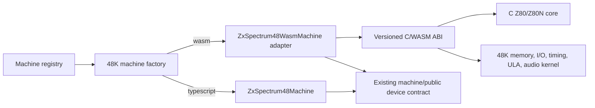

# ZX Spectrum 48K WASM Backend — Completion Plan

## Current baseline

ZX Spectrum 48K machines are still exposed through the existing TypeScript
machine contract. The construction choice is already centralized in
`createZxSpectrum48Machine` through the `sp48Implementation` config value:

| Value | Selected class | Current execution |
| --- | --- | --- |
| omitted / `"typescript"` | `ZxSpectrum48Machine` | Production TypeScript backend |
| `"wasm"` | `ZxSpectrum48WasmMachine` | Compatibility facade until the 48K WASM kernel reaches parity |

The Z80 and Z80N CPU implementation in `src/emu/z80/wasm/` is complete for the
CPU phase. Its tests run through a test-only WASM façade and the ABI has been
cleaned up to use a packed state block instead of per-register exports. The
old opcode-by-opcode migration checklist has no future planning value and has
been removed from this file; the useful fact to carry forward is simply:

- The C/WASM Z80 core is available and covered by cloned opcode-page tests,
  differential stress tests, `npm run build:check`, and the full unit suite.
- The remaining work is not more Z80 instruction migration. It is integrating
  that core into the Spectrum 48K memory, I/O, timing, screen, audio, tape,
  debugger, snapshot, and packaging environment.

## Non-goals and boundaries

- Do not port `MachineController`, renderer state, IDE commands, file-provider
  access, Redux/messaging, or UI debugger policy into WASM.
- Do not cross the JavaScript/WASM boundary per tact, per memory access, or per
  instruction during normal running.
- Do not use dynamic allocation inside the C/WASM emulator implementation.
  All C-side machine state, memory, event buffers, dirty-range tables, and
  temporary work areas must be statically allocated with compile-time bounded
  capacities and surfaced through explicit overflow/status reporting where a
  buffer can fill.
- Do not silently fall back to TypeScript when `sp48Implementation: "wasm"` is
  selected after the adapter starts claiming parity for a feature. Report a
  clear incompatibility or missing artifact instead.
- Keep the backend default controlled by one centralized switch so rollout can
  move between WASM and TypeScript without touching factory call sites.

## Target architecture



`MachineController` continues calling:

```ts
const termination = this.machine.executeMachineFrame();
```

The difference is internal to `ZxSpectrum48WasmMachine`: normal execution calls
a synchronous C frame export and then consumes compact result/event buffers.
Debug execution calls instruction-bounded exports so TypeScript can keep
breakpoint and stepping policy at instruction boundaries.

## ABI shape to converge on

The current seed ABI is useful for tests, but the production 48K backend needs
a single versioned machine ABI around these blocks:

| Block/export family | Purpose |
| --- | --- |
| ABI/version exports | `sp48_abi_version`, layout constants, feature flags, and artifact compatibility checks. |
| Machine state block | CPU state, frame counters, interrupt state, border/FE state, memory model flags, tape flags, and termination fields. |
| Input block | Keyboard rows, joystick/mouse inputs if enabled later, tape input events or pulse window, run/debug options. |
| Memory block | 16K ROM + 48K RAM view, dirty range records, snapshot import/export helpers. |
| Event buffers | Border changes, beeper transitions/audio samples, tape save/MIC events, I/O/debug access records. |
| Execution exports | `sp48_reset`, `sp48_import_state`, `sp48_export_state`, `sp48_execute_frame`, `sp48_execute_instructions`, and small memory/port helpers only where they are needed by tests/debugger. |

All multi-byte fields are little-endian. Every block has a version, byte size,
and tested offset constants. TypeScript reads/writes through typed views rather
than ad hoc pointer arithmetic scattered through the adapter.

## Detailed implementation steps

Each step is intentionally small enough to land independently. Unless a row
says otherwise, the quality gate is:

```sh
npm run build:sp48-wasm
npx vitest run --config build/vitest.config.ts --project node <focused tests>
npm run build:check
```

Run the full `npm run test` suite at the end of every phase and before marking
the row complete in this plan.

### Phase P0 — artifact and ABI foundation

| Step | Work | Focused test gate |
| --- | --- | --- |
| P0.1 | **Completed.** Split the build script’s export list into named production and test ABI manifests. The current test artifact remains explicit and the production-approved list is defined separately. | `test/zxSpectrum/sp48-wasm-build.test.ts`, `test/zxSpectrum/sp48-wasm-abi-manifest.test.ts`, and `test/z80/z80-wasm-abi.test.ts` assert the manifests. |
| P0.2 | **Completed.** Added generated/shared TypeScript constants for production block offsets and sizes, with the build script as the source of truth and C receiving the same values as compile-time defines. | `test/zxSpectrum/sp48-wasm-abi-manifest.test.ts` instantiates the WASM artifact, reads exported layout values, and verifies the generated TypeScript constants. |
| P0.3 | **Completed.** Added an async WASM loader module for the Spectrum 48K adapter with version checking, layout validation, useful error messages, and cached `WebAssembly.Module` reuse. | `test/zxSpectrum/sp48-wasm-loader.test.ts` covers successful load, missing artifact, incompatible ABI version, incompatible layout, and cached instantiation. |
| P0.4 | **Completed.** Wired `ZxSpectrum48WasmMachine.setup()` to load and validate the artifact while still delegating execution/setup behavior to the TypeScript machine path. | `test/zxSpectrum/ZxSpectrum48WasmMachineSetup.test.ts` verifies setup load/validation and no silent fallback on incompatible artifacts. |
| P0.5 | **Completed.** Ensured dev builds resolve the WASM artifact through the renderer bundle and packaged builds declare the WASM artifact resource directory. | `test/zxSpectrum/sp48-wasm-build.test.ts` asserts output path and package/include contract; `npx electron-vite build --config build/electron.vite.config.ts` emits the WASM renderer asset. |

### Phase P1 — 48K memory, reset, and snapshots

| Step | Work | Focused test gate |
| --- | --- | --- |
| P1.1 | **Completed.** Moved 48K ROM/RAM storage for the WASM backend into linear memory, with typed views in the adapter. TypeScript memory remains the reference for differential tests. | `test/zxSpectrum/sp48-wasm-memory.test.ts` covers WASM memory reset/read/write behavior, ROM loading, address wrapping, and adapter views. |
| P1.2 | **Completed.** Implemented 16K ROM write protection and 48K RAM writes in C. Preserved direct memory patch semantics for tests/debugger. | `test/zxSpectrum/sp48-wasm-memory.test.ts` covers ROM writes ignored, RAM writes accepted, 16K upper-RAM protection, and patch paths. |
| P1.3 | **Completed.** Implemented reset parity for memory state, FE port defaults, and model flags in the WASM adapter/core path. | `test/zxSpectrum/sp48-wasm-memory.test.ts` compares selected TypeScript and WASM reset/memory behavior for the 16K model. |
| P1.4 | **Completed.** Added snapshot import/export for memory and CPU-visible state through the packed blocks. | `test/zxSpectrum/sp48-wasm-memory.test.ts` verifies snapshot round-trip of memory, state block data, and FE/ULA state. |
| P1.5 | **Completed.** Added dirty-memory range reporting for C memory helpers, using a statically allocated bounded dirty-range table. | `test/zxSpectrum/sp48-wasm-memory.test.ts` verifies dirty-range records and clear behavior. A static-allocation audit found no dynamic allocation calls in the C/WASM implementation. |

### Phase P2 — CPU integration inside the 48K machine

| Step | Work | Focused test gate |
| --- | --- | --- |
| P2.1 | **Completed.** Added a selectable C Z80 bus mode so the same CPU core can run against the existing test bus or the Spectrum 48K machine bus. The 48K bus dispatches memory reads/writes and FE port reads/writes without JavaScript callbacks. | Existing Z80 WASM tests still pass; `test/zxSpectrum/sp48-wasm-cpu-integration.test.ts` verifies memory and FE port dispatch. |
| P2.2 | **Completed.** Added `sp48_execute_instructions(max_instructions, stop_tact, mode)` for bounded debug-style execution, with instruction count and CPU status in the result block. | Short instruction programs run through TypeScript 48K and WASM 48K, comparing CPU state, memory, tacts, and termination reason. |
| P2.3 | **Completed.** Implemented machine-level HALT progression, INT acceptance, frame-end detection, and execution-point termination in the bounded WASM path. | `test/zxSpectrum/sp48-wasm-cpu-integration.test.ts` covers frame completion, HALT progression, interrupt acceptance, and execution-point stop behavior. |
| P2.4 | **Completed.** Connected `ZxSpectrum48WasmMachine.executeMachineFrame()` to the bounded C export for debug-style/termination-point runs. Normal frame execution remains delegated until P3. | Adapter tests exercise `StepInto`, `UntilExecutionPoint`, and bounded normal termination while the full suite remains green. |
| P2.5 | **Completed.** Added seeded 48K machine-level differential replay for deterministic programs. | Seeded replay compares TypeScript and WASM CPU state, FE output state, and touched RAM windows. |

### Phase P3 — normal frame kernel

| Step | Work | Focused test gate |
| --- | --- | --- |
| P3.1 | **Completed.** Implemented `sp48_execute_frame()` that runs from current state to frame completion without JavaScript callbacks. | Normal-frame fixtures complete a tiny deterministic frame with matching counters and termination mode. |
| P3.2 | **Completed.** Copied keyboard rows from TypeScript into the WASM input block before execution and implemented FE keyboard reads in C. | Keyboard matrix tests compare no-key, single-row, and multi-row reads with the current EAR default/latch semantics. |
| P3.3 | **Completed.** Implemented FE output state in C: border color, EAR latch, MIC latch, and last written FE value. | Port-output tests compare TypeScript and WASM state after representative `OUT (FE),A` programs. |
| P3.4 | **Completed.** Switched normal `ZxSpectrum48WasmMachine.executeMachineFrame()` to `sp48_execute_frame()`. | Machine-frame tests prove the normal WASM backend path does not delegate to TypeScript CPU cycles. |
| P3.5 | **Completed.** Added a fixed-ROM smoke benchmark fixture that runs a deterministic frame on both backends and checks parity before recording timing. | The benchmark smoke test is correctness-first and records timing only as diagnostic output. |

### Phase P4 — contention, floating bus, and ULA timing

| Step | Work | Focused test gate |
| --- | --- | --- |
| P4.1 | **Completed.** Ported 48K memory and I/O contention timing through a statically allocated per-tact contention table copied from the existing TypeScript screen schedule. | Focused timing tests compare TypeScript and WASM tact deltas for contended and uncontended memory access cases. |
| P4.2 | **Completed.** Implemented floating-bus reads in C using a statically allocated per-tact screen-fetch address table and the Spectrum 48K `currentFrameTact - 5` sampling convention. | Floating-bus tests compare TypeScript and WASM reads at representative pixel and attribute fetch tacts. |
| P4.3 | **Completed.** Generated a bounded border-change trace buffer from C for FE writes and frame timing. | Border tests verify event order, frame tact, FE value, border color, EAR latch, and MIC latch. |
| P4.4 | **Completed.** Chose the smallest screen-output strategy: TypeScript continues rendering through the existing screen renderer, reading pixels from WASM RAM and border state/trace from the adapter. | Screen-rendering tests compare deterministic TypeScript and WASM pixel buffers from the same memory pattern. |
| P4.5 | **Completed.** Validated that normal WASM frame execution does not invoke TypeScript CPU cycles, per-tact timing, or memory access hooks. | Adapter guard tests fail if normal WASM execution delegates to TypeScript CPU/tact/memory methods. |

### Phase P5 — beeper/audio

| Step | Work | Focused test gate |
| --- | --- | --- |
| P5.1 | **Completed.** Recorded EAR/MIC transitions in a statically bounded C audio trace region during frame and bounded-instruction execution. | FE-output audio tests verify tact-ordered transition events. |
| P5.2 | **Completed.** Adapted the existing TypeScript beeper plumbing to replay WASM transition traces into the normal `getAudioSamples()` path. | Existing audio-device tests plus a deterministic WASM pulse fixture verify sample generation. |
| P5.3 | **Completed.** Added TypeScript-vs-WASM beeper transition differential fixtures for square-wave and silence programs. | Differential audio fixtures compare transition counts/tacts and EAR/MIC values. |
| P5.4 | **Completed.** Added bounded audio-event overflow reporting with an explicit event-status bit. | Stress test emits more FE transitions than the static trace capacity and verifies bounded reporting. |

### Phase P6 — tape integration

| Step | Work | Focused test gate |
| --- | --- | --- |
| P6.1 | **Completed.** Defined a static tape input/output contract: a per-frame EAR table copied from TypeScript plus a bounded MIC/tape-save trace region. | ABI/layout tests cover tape table capacity, input offsets, trace shape, and status bits. |
| P6.2 | **Completed.** Implemented C-side EAR sampling from the precomputed tape input table while tape mode is LOAD. | Load-tone fixtures compare TypeScript and WASM sampled EAR values at representative tacts. |
| P6.3 | **Completed.** Implemented bounded MIC/tape-save event capture for FE writes while tape mode is SAVE. | Save-event tests compare tact, FE value, MIC, and EAR values for simple output programs. |
| P6.4 | **Completed.** Integrated tape mode updates at WASM execution boundaries and kept fast-load policy in TypeScript. | Machine-frame tests cover fast-load-disabled LOAD mode and boundary behavior. |
| P6.5 | **Completed.** Added a tiny tape data-block loading smoke through TypeScript and WASM boundary handling. | Differential smoke compares loaded memory and final tape mode. |

### Phase P7 — debugger and IDE integration

| Step | Work | Focused test gate |
| --- | --- | --- |
| P7.1 | **Completed.** Exposed instruction-bound memory and I/O access logs from C through fixed SP48 debug-log exports. | Tests verify memory write and port write logs imported into the adapter. |
| P7.2 | **Completed.** Implemented debug-mode execution as one complete C instruction at a time with TypeScript breakpoint policy for step-into, step-over, step-out, run-to-address, and stop-at-breakpoint. | Debug fixtures cover execution, memory, I/O, step-over, step-out, and run-to-address termination. |
| P7.3 | **Completed.** Kept disassembly/execution-point views backend-neutral by syncing CPU state from WASM before exposing the existing `getCpuState()` shape. | Renderer-neutral tests compare visible PC/SP/register state after WASM stepping. |
| P7.4 | **Completed.** Verified normal pause/resume/stop lifecycle remains controller-owned by keeping no-debug frame execution on `sp48_execute_frame()` and debug policy in the adapter. | Guard tests assert normal WASM frame execution does not delegate to TypeScript CPU/tact/memory hooks. |
| P7.5 | **Completed.** Added WASM diagnostics for selected backend, ABI version, artifact name, last termination status, CPU status, and event status. | Diagnostics tests assert useful WASM fields after stepping. |

### Phase P8 — compatibility, packaging, and rollout

| Step | Work | Focused test gate |
| --- | --- | --- |
| P8.1 | **Completed.** Added TypeScript-vs-WASM compatibility fixtures over representative ROM/input scenarios. | Fixed-seed and P8 compatibility fixtures compare CPU state, memory, frame counters, keyboard/FE behavior, contention timing, border/audio traces, tape-save summaries, and tape-load EAR samples. |
| P8.2 | **Completed.** Added a release benchmark harness for fixed ROM/input frames with correctness checked before timing. | The P8 benchmark fixture emits structured TS/WASM timing diagnostics only after CPU and memory parity checks pass. |
| P8.3 | **Completed.** Validated packaged Electron builds can instantiate the WASM artifact from the packaged resource contract. | Build/package tests assert the package resource path and instantiate the artifact bytes copied into packaged builds. |
| P8.4 | **Completed.** Centralized the backend default and flipped it to WASM while preserving an explicit TypeScript fallback switch. | Config/factory tests cover default WASM, explicit WASM, explicit TypeScript, model-level WASM, unknown-selection defaulting, and explicit opt-out from model-level WASM. |
| P8.5 | **Completed.** Documented fallback/error policy and user-facing diagnostics for incompatible artifacts. | Loader tests cover clear missing-artifact/ABI/layout errors; docs note the centralized default switch, explicit backend selection, strict no-silent-fallback WASM loading, diagnostics, packaging, and static-memory limits. |

## Acceptance gates for keeping WASM enabled by default

- `npm run build:check` passes.
- `npm run test` passes.
- Every production C export has a TypeScript declaration, manifest assertion,
  and at least one focused test.
- Normal WASM frame execution crosses the JS/WASM boundary once per frame,
  plus intentional input setup/result consumption.
- Debug execution crosses only at instruction-bounded batches and preserves
  existing breakpoint/stepping behavior.
- ROM/RAM, snapshots, keyboard, FE port, interrupts, contention, floating bus,
  border, audio, and tape smoke fixtures match the TypeScript backend.
- Packaged app builds contain and instantiate the expected WASM artifact.
- A fixed-ROM/input benchmark reports correctness and performance versus the
  TypeScript baseline.
- The selected backend and ABI/artifact details appear in diagnostics.

## Open decisions with future value

- Whether normal WASM execution runs on the renderer thread first, or whether a
  Worker/SharedArrayBuffer split is needed for responsiveness after benchmarks.
- Whether screen output should remain TypeScript-rendered from WASM RAM and
  border traces, or move to a C-produced pixel buffer.
- Whether beeper output should be transition-buffer based or sample-buffer
  based after measuring adapter overhead and audio-device expectations.
- Whether tape input should be copied as precomputed pulse events or generated
  in a C-readable rolling window.
- Whether to keep the first production WASM backend 48K-only or extract a
  reusable Spectrum-family hardware kernel after 48K parity is proven.
