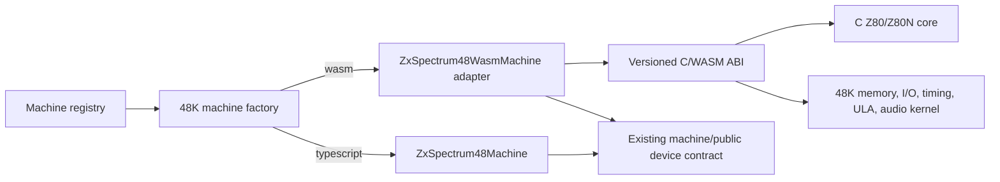

# ZX Spectrum 48K WASM Backend — Completion Plan

## Current baseline

ZX Spectrum 48K machines are still exposed through the existing TypeScript
machine contract. The construction choice is already centralized in
`createZxSpectrum48Machine` through the `sp48Implementation` config value:

| Value | Selected class | Current execution |
| --- | --- | --- |
| omitted / `"typescript"` | `ZxSpectrum48Machine` | Production TypeScript backend |
| `"wasm"` | `ZxSpectrum48WasmMachine` | Compatibility facade until the 48K WASM kernel reaches parity |

The Z80 and Z80N CPU implementation in `src/emu/z80/wasm/` is complete for the
CPU phase. Its tests run through a test-only WASM façade and the ABI has been
cleaned up to use a packed state block instead of per-register exports. The
old opcode-by-opcode migration checklist has no future planning value and has
been removed from this file; the useful fact to carry forward is simply:

- The C/WASM Z80 core is available and covered by cloned opcode-page tests,
  differential stress tests, `npm run build:check`, and the full unit suite.
- The remaining work is not more Z80 instruction migration. It is integrating
  that core into the Spectrum 48K memory, I/O, timing, screen, audio, tape,
  debugger, snapshot, and packaging environment.

## Non-goals and boundaries

- Do not port `MachineController`, renderer state, IDE commands, file-provider
  access, Redux/messaging, or UI debugger policy into WASM.
- Do not cross the JavaScript/WASM boundary per tact, per memory access, or per
  instruction during normal running.
- Do not use dynamic allocation inside the C/WASM emulator implementation.
  All C-side machine state, memory, event buffers, dirty-range tables, and
  temporary work areas must be statically allocated with compile-time bounded
  capacities and surfaced through explicit overflow/status reporting where a
  buffer can fill.
- Do not silently fall back to TypeScript when `sp48Implementation: "wasm"` is
  selected after the adapter starts claiming parity for a feature. Report a
  clear incompatibility or missing artifact instead.
- Keep TypeScript as the default backend until the release gates at the end of
  this plan pass.

## Target architecture



`MachineController` continues calling:

```ts
const termination = this.machine.executeMachineFrame();
```

The difference is internal to `ZxSpectrum48WasmMachine`: normal execution calls
a synchronous C frame export and then consumes compact result/event buffers.
Debug execution calls instruction-bounded exports so TypeScript can keep
breakpoint and stepping policy at instruction boundaries.

## ABI shape to converge on

The current seed ABI is useful for tests, but the production 48K backend needs
a single versioned machine ABI around these blocks:

| Block/export family | Purpose |
| --- | --- |
| ABI/version exports | `sp48_abi_version`, layout constants, feature flags, and artifact compatibility checks. |
| Machine state block | CPU state, frame counters, interrupt state, border/FE state, memory model flags, tape flags, and termination fields. |
| Input block | Keyboard rows, joystick/mouse inputs if enabled later, tape input events or pulse window, run/debug options. |
| Memory block | 16K ROM + 48K RAM view, dirty range records, snapshot import/export helpers. |
| Event buffers | Border changes, beeper transitions/audio samples, tape save/MIC events, I/O/debug access records. |
| Execution exports | `sp48_reset`, `sp48_import_state`, `sp48_export_state`, `sp48_execute_frame`, `sp48_execute_instructions`, and small memory/port helpers only where they are needed by tests/debugger. |

All multi-byte fields are little-endian. Every block has a version, byte size,
and tested offset constants. TypeScript reads/writes through typed views rather
than ad hoc pointer arithmetic scattered through the adapter.

## Detailed implementation steps

Each step is intentionally small enough to land independently. Unless a row
says otherwise, the quality gate is:

```sh
npm run build:sp48-wasm
npx vitest run --config build/vitest.config.ts --project node <focused tests>
npm run build:check
```

Run the full `npm run test` suite at the end of every phase and before marking
the row complete in this plan.

### Phase P0 — artifact and ABI foundation

| Step | Work | Focused test gate |
| --- | --- | --- |
| P0.1 | **Completed.** Split the build script’s export list into named production and test ABI manifests. The current test artifact remains explicit and the production-approved list is defined separately. | `test/zxSpectrum/sp48-wasm-build.test.ts`, `test/zxSpectrum/sp48-wasm-abi-manifest.test.ts`, and `test/z80/z80-wasm-abi.test.ts` assert the manifests. |
| P0.2 | **Completed.** Added generated/shared TypeScript constants for production block offsets and sizes, with the build script as the source of truth and C receiving the same values as compile-time defines. | `test/zxSpectrum/sp48-wasm-abi-manifest.test.ts` instantiates the WASM artifact, reads exported layout values, and verifies the generated TypeScript constants. |
| P0.3 | **Completed.** Added an async WASM loader module for the Spectrum 48K adapter with version checking, layout validation, useful error messages, and cached `WebAssembly.Module` reuse. | `test/zxSpectrum/sp48-wasm-loader.test.ts` covers successful load, missing artifact, incompatible ABI version, incompatible layout, and cached instantiation. |
| P0.4 | **Completed.** Wired `ZxSpectrum48WasmMachine.setup()` to load and validate the artifact while still delegating execution/setup behavior to the TypeScript machine path. | `test/zxSpectrum/ZxSpectrum48WasmMachineSetup.test.ts` verifies setup load/validation and no silent fallback on incompatible artifacts. |
| P0.5 | **Completed.** Ensured dev builds resolve the WASM artifact through the renderer bundle and packaged builds declare the WASM artifact resource directory. | `test/zxSpectrum/sp48-wasm-build.test.ts` asserts output path and package/include contract; `npx electron-vite build --config build/electron.vite.config.ts` emits the WASM renderer asset. |

### Phase P1 — 48K memory, reset, and snapshots

| Step | Work | Focused test gate |
| --- | --- | --- |
| P1.1 | **Completed.** Moved 48K ROM/RAM storage for the WASM backend into linear memory, with typed views in the adapter. TypeScript memory remains the reference for differential tests. | `test/zxSpectrum/sp48-wasm-memory.test.ts` covers WASM memory reset/read/write behavior, ROM loading, address wrapping, and adapter views. |
| P1.2 | **Completed.** Implemented 16K ROM write protection and 48K RAM writes in C. Preserved direct memory patch semantics for tests/debugger. | `test/zxSpectrum/sp48-wasm-memory.test.ts` covers ROM writes ignored, RAM writes accepted, 16K upper-RAM protection, and patch paths. |
| P1.3 | **Completed.** Implemented reset parity for memory state, FE port defaults, and model flags in the WASM adapter/core path. | `test/zxSpectrum/sp48-wasm-memory.test.ts` compares selected TypeScript and WASM reset/memory behavior for the 16K model. |
| P1.4 | **Completed.** Added snapshot import/export for memory and CPU-visible state through the packed blocks. | `test/zxSpectrum/sp48-wasm-memory.test.ts` verifies snapshot round-trip of memory, state block data, and FE/ULA state. |
| P1.5 | **Completed.** Added dirty-memory range reporting for C memory helpers, using a statically allocated bounded dirty-range table. | `test/zxSpectrum/sp48-wasm-memory.test.ts` verifies dirty-range records and clear behavior. A static-allocation audit found no dynamic allocation calls in the C/WASM implementation. |

### Phase P2 — CPU integration inside the 48K machine

| Step | Work | Focused test gate |
| --- | --- | --- |
| P2.1 | Replace the standalone Z80 test bus with a 48K machine bus implementation for memory reads/writes and port reads/writes. Keep the test bus only for `test/z80`. | Existing Z80 WASM tests still pass; new 48K bus tests verify memory and FE port dispatch. |
| P2.2 | Add `sp48_execute_instructions(max_instructions, stop_tact, mode)` for bounded debug-style execution. | Run short instruction programs through TypeScript 48K and WASM 48K, comparing CPU state, memory, tacts, and termination reason. |
| P2.3 | Implement HALT, INT scheduling, frame-end detection, and termination modes at the machine level. | Tests cover normal frame completion, HALT progression, interrupt acceptance, and execution-point stop behavior. |
| P2.4 | Connect `ZxSpectrum48WasmMachine.executeMachineFrame()` to the bounded C export for debug modes, while keeping normal mode delegated until P3. | Existing debugger stepping/unit tests pass with `sp48Implementation: "wasm"` where applicable. |
| P2.5 | Add seeded differential instruction replay at the 48K machine level. | New replay tests compare TypeScript and WASM over deterministic programs with memory, I/O, interrupts, and stop conditions. |

### Phase P3 — normal frame kernel

| Step | Work | Focused test gate |
| --- | --- | --- |
| P3.1 | Implement `sp48_execute_frame()` that runs from current state to frame completion without JavaScript callbacks. | A no-I/O instruction-loop fixture completes one frame with matching frame counters and termination mode. |
| P3.2 | Copy keyboard rows from TypeScript into the WASM input block before frame execution; implement FE keyboard reads in C. | Keyboard matrix tests compare FE reads for no keys, single key, multi-key rows, and contention with EAR bit defaults. |
| P3.3 | Implement FE output state in C: border color, EAR/MIC latch state, and last written value. | Port-output tests compare TypeScript and WASM state after representative `OUT (FE),A` programs. |
| P3.4 | Switch normal `ZxSpectrum48WasmMachine.executeMachineFrame()` to `sp48_execute_frame()`. | Factory/machine-frame tests prove the WASM backend no longer delegates normal frame execution to TypeScript. |
| P3.5 | Add a fixed-ROM smoke benchmark fixture that runs a deterministic frame on both backends and checks state parity before measuring time. | Benchmark test is correctness-first and records timing only as diagnostic output. |

### Phase P4 — contention, floating bus, and ULA timing

| Step | Work | Focused test gate |
| --- | --- | --- |
| P4.1 | Port 48K memory-contention timing for contended RAM and ULA fetch phases. | Focused timing tests compare tact deltas for contended/uncontended memory access cases. |
| P4.2 | Implement floating-bus reads in C using the current tact and screen fetch schedule. | Existing or new floating-bus tests compare values across representative tacts and screen addresses. |
| P4.3 | Generate a border-change trace buffer from C for FE writes and frame timing. | Border tests compare event order, tact, color, and frame-boundary behavior. |
| P4.4 | Decide and implement the screen-output strategy: TypeScript renders from WASM RAM plus border trace, or C fills a frame pixel buffer. Prefer the smallest change that preserves current rendering semantics. | Golden/snapshot screen tests compare a deterministic screen memory pattern and border program. |
| P4.5 | Validate no normal-frame path invokes TypeScript per tact or per instruction. | Add an adapter-level spy/test that fails if normal WASM execution calls TypeScript CPU/frame-runner methods. |

### Phase P5 — beeper/audio

| Step | Work | Focused test gate |
| --- | --- | --- |
| P5.1 | Record EAR/MIC transitions in a C event buffer during frame execution. | FE-output audio tests verify tact-ordered transition events. |
| P5.2 | Adapt the TypeScript audio plumbing to consume WASM transition events or a generated sample buffer. | Existing audio-device tests plus a new deterministic pulse fixture. |
| P5.3 | Compare TypeScript and WASM beeper output for simple square-wave and silence programs. | Differential audio fixtures compare transition counts/tacts or normalized sample windows. |
| P5.4 | Include audio-event buffer overflow handling with explicit termination/error status. | Stress test emits many FE writes and verifies bounded behavior is reported, not silently truncated. |

### Phase P6 — tape integration

| Step | Work | Focused test gate |
| --- | --- | --- |
| P6.1 | Define the tape input contract: precomputed pulse/event buffer copied from TypeScript, or C-readable pulse window generated before execution. | ABI/layout test covers tape input block shape and version. |
| P6.2 | Implement EAR sampling from the tape input contract during C execution. | Load-tone fixtures compare sampled EAR values at representative tacts. |
| P6.3 | Implement MIC/tape-save event capture for FE writes. | Save-event tests compare TypeScript and WASM event timing for simple output programs. |
| P6.4 | Integrate tape mode updates at frame or bounded-instruction boundaries, not per instruction in normal mode. | Machine-frame tests cover play/stop transitions and fast-load disabled/enabled boundaries. |
| P6.5 | Run a small TAP/TZX loading smoke fixture through both backends. | Differential tape smoke test compares loaded memory block and termination status. |

### Phase P7 — debugger and IDE integration

| Step | Work | Focused test gate |
| --- | --- | --- |
| P7.1 | Expose instruction-bound access logs from C for debugger memory/I/O breakpoints. | Tests verify memory read/write, port read/write, and TBBlue-style logs where applicable. |
| P7.2 | Implement step-into, step-over, step-out, run-to-address, and stop-at-breakpoint using bounded C execution plus TypeScript policy. | Existing debugger tests run against both `"typescript"` and `"wasm"` machine selections. |
| P7.3 | Update disassembly/execution-point views to read current CPU state from the WASM adapter. | Renderer-neutral unit tests compare visible PC/SP/register state after stepping. |
| P7.4 | Verify pause/resume/stop lifecycle and frame-completed events remain controller-owned. | MachineController tests assert no WASM-specific branch is required. |
| P7.5 | Add diagnostic output for selected backend, ABI version, artifact path, and last WASM termination status. | Diagnostics tests assert useful fields for both backends. |

### Phase P8 — compatibility, packaging, and rollout

| Step | Work | Focused test gate |
| --- | --- | --- |
| P8.1 | Run full TypeScript-vs-WASM machine differential fixtures over representative ROM/input scenarios. | Fixed-seed compatibility suite compares CPU state, memory, frame counters, border/audio/tape summaries. |
| P8.2 | Add release benchmark harness for fixed ROM/input frames with correctness checked before timing. | Benchmark emits TS/WASM timings and fails on correctness mismatch. |
| P8.3 | Validate packaged Electron builds can instantiate the WASM artifact on supported platforms. | Packaging smoke test or CI job opens/instantiates the artifact from packaged paths. |
| P8.4 | Keep TypeScript as default; expose WASM through explicit preference/experiment once compatibility and benchmark gates pass. | Config/factory tests cover default and explicit backend selection. |
| P8.5 | Document fallback/error policy and user-facing diagnostics for incompatible artifacts. | Unit tests cover error messages; docs note known limits and support status. |

## Acceptance gates for enabling WASM by default later

- `npm run build:check` passes.
- `npm run test` passes.
- Every production C export has a TypeScript declaration, manifest assertion,
  and at least one focused test.
- Normal WASM frame execution crosses the JS/WASM boundary once per frame,
  plus intentional input setup/result consumption.
- Debug execution crosses only at instruction-bounded batches and preserves
  existing breakpoint/stepping behavior.
- ROM/RAM, snapshots, keyboard, FE port, interrupts, contention, floating bus,
  border, audio, and tape smoke fixtures match the TypeScript backend.
- Packaged app builds contain and instantiate the expected WASM artifact.
- A fixed-ROM/input benchmark reports correctness and performance versus the
  TypeScript baseline.
- The selected backend and ABI/artifact details appear in diagnostics.

## Open decisions with future value

- Whether normal WASM execution runs on the renderer thread first, or whether a
  Worker/SharedArrayBuffer split is needed for responsiveness after benchmarks.
- Whether screen output should remain TypeScript-rendered from WASM RAM and
  border traces, or move to a C-produced pixel buffer.
- Whether beeper output should be transition-buffer based or sample-buffer
  based after measuring adapter overhead and audio-device expectations.
- Whether tape input should be copied as precomputed pulse events or generated
  in a C-readable rolling window.
- Whether to keep the first production WASM backend 48K-only or extract a
  reusable Spectrum-family hardware kernel after 48K parity is proven.
