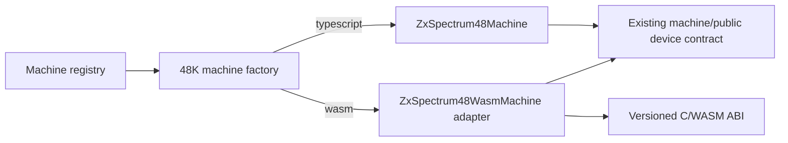

# ZX Spectrum 48K TypeScript/WASM Backend — Initial Plan

## Purpose and current baseline

ZX Spectrum machines are currently TypeScript classes in `src/emu`. The 48K
entry point now goes through `createZxSpectrum48Machine`, which reads the
`sp48Implementation` machine-config value:

| Value | Selected class | Current execution |
| --- | --- | --- |
| omitted / `"typescript"` | `ZxSpectrum48Machine` | Existing TypeScript machine |
| `"wasm"` | `ZxSpectrum48WasmMachine` | Compatibility facade delegating to TypeScript until C parity |

This is deliberately a per-machine construction decision, rather than a global
flag or renderer condition. All existing consumers keep the same machine
contract. The WASM facade must not claim performance benefits until it owns a
measured execution slice.

The C seed lives in `src/emu/machines/zxSpectrum48/wasm/`. It exposes a small,
versioned ABI for memory, reset, ROM upload, and ULA-port ownership. Run
`npm run build:sp48-wasm` to create its local `.wasm` artifact. The automated
test intentionally uses a fake compiler runner: it verifies the ABI export list
and command contract without adding a system compiler to CI.

## Target architecture



The adapter owns WASM loading, version checks, typed-memory views, error
reporting, and synchronization boundaries. C owns CPU state and hot execution
paths only after each path has conformance coverage. TypeScript continues to own
Electron integration, UI/debugger objects, host file access, and orchestration.

## Confirmed integration boundary: `MachineController` stays TypeScript

The proposed boundary is correct. `MachineController` should remain unchanged:
its synchronous call at `MachineController.ts:510` is already the right single
entry point to replace. It measures the call, raises `frameCompleted`, performs
UI pacing, services frame commands, handles media notifications, and owns the
pause/stop lifecycle. None of that benefits from a C port, and moving it would
make Electron/UI integration needlessly harder.

For the WASM backend, `ZxSpectrum48WasmMachine.executeMachineFrame()` will call
a synchronous C export such as `sp48_execute_frame(run_mode, stop_tact)`, copy
the compact result/state required by the existing machine contract, and return
the matching `FrameTerminationMode`. From the controller's perspective it is
still exactly this call:

```ts
const termination = this.machine.executeMachineFrame();
```

There are two required execution modes behind that one API:

| Existing controller mode | WASM entry point | Why |
| --- | --- | --- |
| Normal running (`NoDebug`) | Run an entire frame in C | This is the performance path. It must not call TypeScript per instruction or per tact. |
| Breakpoints, step-into/over/out, execution-point runs | Run bounded instruction batches / one complete instruction in C | TypeScript retains the debugger policy and checks exported state/events at instruction boundaries. |

The qualification is important: replacing only the outer method while letting C
call TypeScript for every instruction, tact, memory access, or ULA port access
will both lose most of the gain and risk timing mismatches. The WASM kernel must
instead produce compact batches: final CPU/frame state, dirty-memory ranges,
border/audio events, and I/O/debug access records. The TypeScript adapter
applies those batches after the C call returns.

## 48K WASM migration inventory

This table distinguishes source ownership from the public TypeScript API. A
class marked "C counterpart required" can keep a TypeScript adapter with the
same public methods; its hot mutable state and behavior move into the C module.

| Current TypeScript source | C counterpart required? | WASM responsibility / TypeScript boundary |
| --- | --- | --- |
| `src/emu/z80/Z80Cpu.ts` (including standard, CB, ED, DD/FD, DDCB/FDCB tables) | **Yes** | Full Z80 register state, flags, prefixes, interrupts, instruction decode, memory/I/O cycles, tact advancement, and access diagnostics. This is the largest and highest-value port. |
| `src/emu/machines/MachineFrameRunner.ts` | **Yes, execution portion** | C owns the normal frame loop and instruction-bounded debug loop. TypeScript keeps the `IMachineFrameRunner` shape only if useful for the adapter; it must not loop through `executeCpuCycle()` during normal WASM execution. |
| `src/emu/machines/Z80MachineBase.ts` | **Split** | C owns CPU/frame counters, frame-complete detection, interrupts, and queued timing events that affect execution. TypeScript retains machine properties, code injection orchestration, controller-facing APIs, file-provider access, and debugger objects. |
| `src/emu/machines/ZxSpectrumBase.ts` | **Yes, hot hardware part** | C implements 48K memory/I/O contention, FE-port electrical state, interrupt window, tact-driven ULA/audio scheduling, and floating-bus-relevant timing. TypeScript retains keystroke queue administration and high-level helpers. |
| `src/emu/machines/zxSpectrum48/ZxSpectrum48Machine.ts` | **Yes, stateful core part** | C owns 64K memory, ROM/RAM write protection, 16K-model rule, ROM upload target, port dispatch, and reset. The TypeScript class becomes the adapter exposing the existing machine interface. |
| `src/emu/machines/CommonScreenDevice.ts` | **Yes for timing; rendering may be split** | C must own the ULA timing/contention schedule and border-change trace because `ZxSpectrumBase.onTactIncremented()` currently invokes screen work on every tact. TypeScript may render once per frame from shared WASM RAM plus the border trace; alternatively C can fill a pixel buffer. |
| `src/emu/machines/zxSpectrum48/ZxSpectrum48FloatingBusDevice.ts` | **Yes** | Its value depends on the exact ULA fetch phase and screen memory at the current tact, so it belongs with the C ULA schedule. |
| `src/emu/machines/BeeperDevice.ts` / `AudioDeviceBase.ts` | **Yes for Spectrum beeper timing** | C records FE EAR/MIC transitions or produces a frame audio buffer. TypeScript keeps audio-output plumbing and converts the compact C output to the existing `AudioSample[]` API. |
| `src/emu/machines/zxSpectrum/SpectrumKeyboardDevice.ts` | **No full port required** | Keep host key mapping/state in TypeScript; before every C batch copy the eight keyboard rows to a small WASM input block. C reads that block for FE-port input. |
| `src/emu/machines/tape/TapeDevice.ts` | **Split; behavior required in C for unrestricted frame execution** | File parsing, tape UI, and persistence stay TypeScript. The pulse clock, EAR sampling, MIC edge capture, and fast-load decision must have a C counterpart or a precomputed input/event buffer; calling `updateTapeMode()` after every C instruction defeats the frame kernel. Saved blocks are returned as compact events. |
| `MachineController.ts`, renderer abstractions, `LiteEvent`, Redux/messaging, file providers, debugger UI, snapshots UI | **No** | These remain TypeScript host code. The adapter exposes state snapshots/access logs required by existing consumers. |
| TypeScript interfaces, enums, configuration records, and helper structs | **No direct port** | Define matching C ABI constants/packed structs and test their layout/version; retain these types as the public boundary. |

### Required WASM state and batch ABI

The initial scalar ABI is only a seed. Before porting the CPU, define a stable
packed state block in linear memory containing CPU registers, frame/tact fields,
interrupt/prefix state, last-memory/I/O access diagnostics, keyboard rows, and
machine flags. `sp48_execute_frame` must return a result block with termination
reason, frame-complete flag, dirty memory range(s), and offsets/counts for border,
audio, tape, and debug-event buffers. The adapter reads these views without
per-byte copying wherever possible.

The 48K screen and beeper are explicitly part of the execution kernel, not
post-frame decorations: their current behavior is driven from
`ZxSpectrumBase.onTactIncremented()` and FE writes. Keeping those calls in
TypeScript at tact frequency would create the exact cross-boundary overhead this
project is trying to remove.

## Detailed Z80 and Z80N WASM migration plan

### Scope, design rules, and source layout

This is a CPU-first migration. It deliberately precedes the 48K frame kernel:
the CPU has a mature, isolated test suite in `test/z80` (75 test files), while
the machine integration has hardware timing dependencies. The migration creates
an independent C implementation; it does **not** mechanically translate the
TypeScript `Z80Cpu.ts` operation functions.

Suggested source layout:

```text
src/emu/z80/wasm/
  z80_state.h              # internal CPU state and register helpers
  z80_abi.h / z80_abi.c    # stable exported ABI and state serialization
  z80_decode.c             # prefix/decode state machine
  z80_alu.c                # arithmetic, flag, rotate/shift primitives
  z80_base.c               # unprefixed instruction groups
  z80_cb.c                 # CB instructions
  z80_ed.c                 # ED instructions
  z80_index.c              # shared IX/IY and DDCB/FDCB implementation
  z80_interrupts.c         # reset, HALT, INT/NMI/EI behavior
  z80n.c                   # Z80N ED extensions and timing scale
  z80_test_bus.c           # test-only deterministic memory/I/O/event bus
```

`z80_abi.c` is deliberately not in that list of CPU implementation units: it
contains exported ABI wrappers only. It may validate arguments and translate
packed ABI data, but it must not own CPU state, decode tables, instruction
functions, tact accounting, or memory/port execution logic.

C uses fixed-width unsigned types (`uint8_t`, `uint16_t`, `uint32_t`) and an
internal register-pair union, for example `union { uint16_t w; struct { uint8_t
lo, hi; } b; }`. WebAssembly is little-endian, so `b.hi` is the Z80 high byte;
this assumption is asserted in the C build tests. The union is internal only.
The public WASM ABI uses explicit offsets/accessors rather than exposing a C
struct with compiler-dependent padding.

The C decoder should be structured around operand/addressing-mode and ALU
helpers (8-bit register selector, 16-bit pair selector, indexed effective
address, flag builders, fetch/read/write primitives), with compact decode
metadata where it helps. It must not reproduce the TypeScript class hierarchy
or DataView layout.

### C opcode implementation conventions

The execution model intentionally mirrors the readable structure of
`Z80Cpu.executeCpuCycle()`: one central `execute_cpu_cycle` routine handles
signals, HALT, opcode fetch, and prefix selection; prefix-specific 256-entry
operation tables select C function pointers. This is an implementation-shape
requirement, not a claim that C must copy TypeScript internals.

- Give operation functions meaningful instruction names, such as `ld_bc_nn`,
  `add_hl_de`, and `ld_a_indirect_bc`; never use opcode-only names such as
  `op_1a`.
- Precede every operation with an opcode/mnemonic comment (`// 0x1A: LD A,(DE)`).
- Write operation bodies over multiple logical lines, with named temporary
  values and visible tact, register, flag, and memory effects. Do not compress
  a whole instruction into one line.
- Keep reusable mechanics in helpers (`fetch_word`, `add16`, `inc8`, and so
  on), but retain a separately named table entry for each opcode unless several
  entries genuinely have identical Z80 semantics.
- Use `void` operation functions. The central dispatcher converts a successful
  function-pointer call into the ABI completion result; it alone reports the
  illegal-operation result for the named illegal table entry. Prefix flow also
  belongs only to `execute_cpu_cycle`, matching the TypeScript control flow.

### TypeScript-to-C naming compatibility

Where C has an equivalent concept, retain the original `Z80Cpu.ts` name in C
camelCase rather than introducing a translation layer of synonyms. In
particular, `executeCpuCycle`, `tactPlusN`, `refreshMemory`, `readMemory`,
`writeMemory`, `readPort`, `writePort`, `fetchCodeByte`, `processNmi`, and
`processInt` use those names in the CPU source. Instruction functions likewise
use their original names (`ldBcNN`, `ldBciA`, `addHlDe`, `ldADei`, and so on).
The only intentional C naming differences are type names and exported ABI
symbols, which remain `Z80State` and `z80_*` respectively.

#### Z5 CPU/ABI source-boundary correction — completed 2026-08-02

Before S20, split the current prototype as follows:

1. **Completed.** Create `z80_cpu.h` as the internal CPU contract, exposing `Z80State`,
   `reset`, `executeCpuCycle`, and the narrowly scoped helper entry points
   required by ABI test wrappers.
2. **Completed.** Move CPU state, `executeCpuCycle`, all prefix tables, instruction functions,
   tact/refresh logic, interrupt handling, and CPU primitives into `z80_cpu.c`.
3. Deferred: retain the deterministic RAM/I/O/log implementation in the ABI
   test wrapper until its production/test artifact split; the CPU accesses it
   only through the separate compilation-unit boundary.
   `z80_cpu.c` calls its named `readMemory`/`writeMemory`/port functions.
4. **Completed for the current prototype.** Reduce `z80_abi.c` to exported wrappers around the CPU and test-bus
   contracts. It contains no opcode table or instruction implementation.
5. **Completed.** Compile each C unit separately in the fake WASM build. The existing ABI,
   primitive, and literal S00/S10 clone tests are the no-regression gate; add a
   build assertion that `z80_abi.c` no longer includes the CPU implementation.

### Z0 ABI ownership and lifetime

The Z0 exports are intentionally small building blocks, but they do not all
belong to the eventual production frame API:

| Export group | Explicit consumer | Lifetime |
| --- | --- | --- |
| `z80_abi_version`, `z80_reset` | Production WASM adapter during setup/reset | Stable production ABI. |
| `z80_execute_instruction` | WASM CPU façade, debugger/step path; Z1 implements its fetch/decode behavior | Stable production ABI, later complemented by a frame/batch entry point. |
| `z80_state_read_*`, `z80_state_write_*`, `z80_state_size` | `Z80WasmTestCpu` and the early debugger-facing façade | Transitional diagnostic/test ABI. Normal frame execution must use one packed state/result view rather than per-register calls. |
| `z80_test_memory_*`, `z80_test_*_log_capacity`, `z80_test_bus_reset` | Test-only WASM module and `wasm-test-z80.ts` | Test-only; omitted or hidden from the packaged production artifact once the production bus ABI exists. |
| `z80_register_layout_probe` | ABI unit test | Test-only; remove after the C toolchain/layout test is established. |

Thus none of the register accessors or test-bus functions are speculative hot
path calls. They exist to make the current Z0 state observable and to support
the promised reuse of the existing Z80 tests. The production normal-run path
will call a bounded execution export and read bulk views only.

### Clone each existing opcode page for the WASM implementation

The TypeScript reference suite remains untouched. For every migrated opcode
page, clone its existing test file as `test/z80/<source-name>.wasm.test.ts` and change
only its `Z80TestMachine`/`RunMode` import to the WASM test harness. The test
cases themselves—including programs, setup, assertions, and descriptions—are
kept literally identical. This gives each backend an independently runnable,
human-readable acceptance page without changing the trusted TypeScript tests:

1. Add a dedicated `wasm-test-z80.ts` test-only CPU façade with the subset of
   the `Z80TestMachine` API used by the cloned page: register access, `reset`,
   `executeCpuCycle`, prefix/HALT state, tacts, memory, and assertion helpers.
   The existing `test-z80.ts`, `Z80TestCpu`, and `Z80NTestCpu` are not changed.
2. Each clone imports `RunMode` and `Z80TestMachine` from `wasm-test-z80.ts`;
   all remaining lines stay identical to its TypeScript source page. Keep a
   source-to-clone mapping in this table so reviewers can verify the invariant.
3. The WASM test module uses a test-only in-linear-memory bus: 64K RAM,
   preloaded I/O input bytes, and fixed-capacity memory/I/O/TBBlue event logs.
   After each instruction, the façade exposes these logs as the existing
   `memoryAccessLog`, `ioAccessLog`, and `tbBlueAccessLog` shapes. This preserves
   assertions in `memoryOp.test.ts` and `next-ops.test.ts` without host callbacks.
4. Run a differential helper in addition to the cloned assertions. For a
   selected program and initial state it executes both façades and compares full
   register state, memory, tacts/frame fields, prefix/HALT/interrupt state, and
   ordered bus logs. A mismatch reports the opcode bytes and first diverging
   field/event.

The test build may instantiate WASM synchronously from a prebuilt binary so the
current synchronous `Z80TestMachine` API remains usable. Production loading is
still asynchronous during machine setup; this is a test harness convenience,
not a production architecture decision.

### Common test gate for every migration step

No step is considered complete until all four checks pass:

1. The shared C-focused ABI and primitive tests affected by the helper or
   instruction family pass. Do not add a duplicate opcode-range test when the
   literal WASM clone already covers the same behavior.
2. The literal WASM clone of the mapped `test/z80` file passes with the WASM
   façade.
3. The original TypeScript file passes unchanged, preserving the reference
   suite.
4. The differential harness compares the migrated family over deterministic
   edge-value vectors (all flag combinations where applicable, `0x00`, `0x01`,
   `0x7f`, `0x80`, `0xff`, carry boundaries, and wraparound addresses) and
   randomized seeded programs/states for that family.

The complete existing suite runs in both backends after each completed opcode
page. A temporary allow-list may select only migrated opcode pages for WASM
execution; an unimplemented opcode must fail conspicuously, never fall back to
TypeScript.

### Incremental execution steps

#### Foundation and execution semantics

**Progress:** Z0 through Z5 and S00–SF0 completed on 2026-08-02. The module now has a
versioned Z80 ABI, C-native register pairs, explicit state accessors, reset
semantics, 64K test RAM, fixed-capacity test-bus log storage, a fetch/execution
shell, native interrupt acceptance, and the shared C primitives required for
opcode migration. The shell supports NOP, prefix transitions, refresh-register
semantics, base tact accounting, HALT dummy M1 cycles, RESET/NMI/INT handling,
and IM 0/1/2 vectors; unsupported opcodes return an explicit result. S00 adds
literal WASM test-page clones and their `00–1F` instruction families. Its
central execution cycle now follows the TypeScript model: signal/HALT/fetch and
prefix flow in one routine, with operation tables selecting C function pointers.
It is intentionally not yet connected to the production CPU.

| Step | C/WASM work | Immediate existing-test gate |
| --- | --- | --- |
| Z0 | **Completed.** Add `z80_abi` with ABI version, reset, state import/export, 64K test RAM, bus-log buffers, and one-instruction execution result. Add C layout/endianness tests. | New ABI smoke tests plus `z80.test.ts` register/reset checks. |
| Z1 | **Completed.** Implement fetch, PC increment/wrap, R refresh behavior, prefix state, instruction-completion reporting, cycle/tact accounting, and HALT dummy M1 behavior. | WASM ABI execution-shell coverage plus `z80.test.ts` reference checks. The full memory-operation and HALT opcode files activate when their corresponding opcode semantics migrate. |
| Z2 | **Completed.** Implement RESET, NMI, INT, IM 0/1/2, EI backlog, and `LD A,I`/`LD A,R` interrupt-quirk support. RETN/RETI opcode decoding remains in the ED migration step; its IFF state is already represented. | WASM interrupt ABI coverage plus `interrupts.test.ts` reference checks. The real LD A,I/R and RETN/RETI opcode cases activate with ED `40–7F`. |
| Z3 | **Completed.** Implement shared C primitives before opcode pages: fetch byte/word, memory/port read/write logging, stack push/pop, signed displacement, 8-bit add/sub flag builders, parity lookup, and condition evaluation. 16-bit arithmetic and SZ53-specialized tables will be completed alongside their first consumers. | New primitive tests plus `memoryOp.test.ts` reference checks. |
| Z4 | **Completed.** Align the C execution structure with `Z80Cpu.executeCpuCycle()`: `execute_cpu_cycle` owns signal, HALT, M1 fetch, and prefix transitions; standard, CB, ED, indexed, and indexed-bit operation tables dispatch to C function pointers. Every unimplemented entry explicitly resolves to the illegal-operation result. | Existing S00/S10 WASM clones, ABI, and primitive tests continue to pass. |

#### Standard Z80 instruction pages

Migrate unprefixed opcode pages in the same `0x10` ranges used by the current
suite. Each row is a separate reviewable change and immediately enables the
named existing test file in the WASM project.

| Step | Opcode range / family | Immediate gate |
| --- | --- | --- |
| S00 | **Completed.** `00–0F`: NOP, 16-bit loads/inc/dec, 8-bit inc/dec/load, rotate A. `LD HL,nn` and `LD A,n` are minimal setup dependencies required by the literal clone; their full pages remain pending. | `standard-ops-00.test.ts` → `standard-ops-00.wasm.test.ts` |
| S10 | **Completed.** `10–1F`: DJNZ, JR, DE loads/inc/dec, RLA/RRA, and ADD HL,DE. `SCF` is a minimal setup dependency required by the literal clone; its full page remains pending. | `standard-ops-10.test.ts` → `standard-ops-10.wasm.test.ts` |
| S20 | **Completed.** `20–2F`: conditional JR, HL loads/transfers/inc/dec, DAA, and CPL. `DEC A` is a setup dependency for the unchanged conditional-JR cases. | `standard-ops-20.test.ts` → `standard-ops-20.wasm.test.ts` |
| S30 | **Completed.** `30–3F`: conditional JR, SP operations, `(HL)` increment/decrement/load, SCF/CCF, and A memory transfers. | `standard-ops-30.test.ts` → `standard-ops-30.wasm.test.ts` |
| S40 | **Completed.** `40–4F` register-to-register loads and `(HL)` sources. | `standard-ops-40.test.ts` → `standard-ops-40.wasm.test.ts` |
| S50 | **Completed.** `50–5F` register-to-register loads and `(HL)` sources. | `standard-ops-50.test.ts` → `standard-ops-50.wasm.test.ts` |
| S60 | **Completed.** `60–6F` register-to-register loads and `(HL)` sources. These encodings share `ldRegisterToRegister`, a selector-based operation because their Z80 semantics are identical. | `standard-ops-60.test.ts` → `standard-ops-60.wasm.test.ts` |
| S70 | **Completed.** `70–7F`: `(HL)` stores/loads and HALT. | `standard-ops-70.test.ts` → `standard-ops-70.wasm.test.ts` |
| S80 | **Completed.** `80–8F`: ADD/ADC A,r/(HL). | `standard-ops-80.test.ts` → `standard-ops-80.wasm.test.ts` |
| S90 | **Completed.** `90–9F`: SUB/SBC A,r/(HL). | `standard-ops-90.test.ts` → `standard-ops-90.wasm.test.ts` |
| SA0 | **Completed.** `A0–AF`: AND/XOR A,r/(HL). | `standard-ops-a0.test.ts` → `standard-ops-a0.wasm.test.ts` |
| SB0 | **Completed.** `B0–BF`: OR/CP A,r/(HL). | `standard-ops-b0.test.ts` → `standard-ops-b0.wasm.test.ts` |
| SC0 | **Completed.** `C0–CF`: conditional RET/JP/CALL, stack, RST, and CB prefix dispatch. | `standard-ops-c0.test.ts` → `standard-ops-c0.wasm.test.ts` |
| SD0 | **Completed.** `D0–DF`: conditional RET/JP/CALL, EXX, immediate IN/OUT, and RST. The WASM test machine exposes the original I/O input sequence and access-log contract. | `standard-ops-d0.test.ts` → `standard-ops-d0.wasm.test.ts` |
| SE0 | **Completed.** `E0–EF`: conditional RET/JP/CALL, `EX (SP),HL`, immediate AND/XOR, `JP (HL)`, `EX DE,HL`, and RST. | `standard-ops-e0.test.ts` → `standard-ops-e0.wasm.test.ts` |
| SF0 | **Completed.** `F0–FF`: conditional RET/JP/CALL, DI/EI, stack operations, immediate OR/CP, `LD SP,HL`, and RST. | `standard-ops-f0.test.ts` → `standard-ops-f0.wasm.test.ts` |

After every four standard pages, run all sixteen `standard-ops-*.test.ts` files
on both façades. After SF0, run all standard pages plus `z80.test.ts`,
`memoryOp.test.ts`, and `interrupts.test.ts` before beginning prefixed families.
S00–SF0 were verified with `npm run test` (19,031 tests; 14 intentionally
skipped) and `npm run build:check` on 2026-08-02.

#### CB and ED prefixed Z80 instructions

| Step | C/WASM work | Immediate existing-test gate |
| --- | --- | --- |
| C0 | **Completed.** CB rotate/shift groups `00–3F`, including `(HL)` read-modify-write cycles and undocumented flag bits. | `bit-ops-00.test.ts`, `bit-ops-10.test.ts`, `bit-ops-20.test.ts`, `bit-ops-30.test.ts` |
| C1 | **Completed.** CB `BIT b,r/(HL)` with correct S/Z/PV/H/N and undocumented 3/5 flag sources. | `bit-ops-bit.test.ts` |
| C2 | **Completed.** CB `RES b,r/(HL)`. | `bit-ops-res.test.ts` |
| C3 | **Completed.** CB `SET b,r/(HL)`. | `bit-ops-set.test.ts` |
| E0 | ED `40–7F`: IN/OUT `(C)`, 16-bit ADC/SBC, 16-bit memory transfers, NEG, IM, RRD/RLD, RETN/RETI. | `ext-ops-40.test.ts`, `ext-ops-50.test.ts`, `ext-ops-60.test.ts`, `ext-ops-70.test.ts` |
| E1 | ED `A0–AF`: block transfer/search/input/output families and repeat termination. | `ext-op-a0.test.ts` |
| E2 | ED `B0–BF`: repeat block transfer/search/input/output families and exact PC/tact behavior. | `ext-op-b0.test.ts` |

#### IX/IY and indexed-bit instructions

IX and IY are one generic C implementation parameterized by the selected index
register; they are not two copied opcode sets. Each row enables both equivalent
test files when they exist.

| Step | C/WASM work | Immediate existing-test gate |
| --- | --- | --- |
| I0 | DD/FD prefix chaining/override rules, IXH/IXL/IYH/IYL access, and indexed effective-address helper. | `ix-ops-00.test.ts`, `iy-ops-00.test.ts` |
| I1 | Indexed `10–3F` control, 16-bit, and increment/decrement instructions. | `ix-ops-10/20/30.test.ts`, `iy-ops-10/20/30.test.ts` |
| I2 | Indexed `40–7F` loads, `(IX/IY+d)` transfers, and HALT/prefix edge cases. | `ix-ops-40/50/60/70.test.ts`, `iy-ops-40/50/60/70.test.ts` |
| I3 | Indexed `80–BF` ALU operations. | `ix-ops-80/90/a0/b0.test.ts`, `iy-ops-80/90/a0/b0.test.ts` |
| I4 | Indexed `C0–FF` stack, control-flow, exchange, and SP operations. | `ix-ops-c0/d0/e0/f0.test.ts`, `iy-ops-c0/d0/e0/f0.test.ts` |
| I5 | DDCB/FDCB rotate/shift `00–3F`; preserve the register-copy semantics of indexed CB operations. | `ix-bit-ops-00/10/20/30.test.ts`, `iy-bit-ops-00/10/20/30.test.ts` |
| I6 | DDCB/FDCB `BIT`, `RES`, and `SET`, including indexed undocumented flags and displacement wrapping. | `ix-bit-ops-bit.test.ts`, `iy-bit-ops.bit.test.ts`, `ix-bit-ops-res.test.ts`, `ix-bit-ops-set.test.ts` plus their IY counterparts when present; add missing IY RES/SET parity cases before declaring this step complete. |

The final clause in I6 is intentional: the inventory currently exposes IX
RES/SET test files but not corresponding IY RES/SET filenames. Add the missing
IY cases to the shared suite first, then use them for both implementations.

#### Z80N extension steps

Z80N shares the completed Z80 core and only replaces/extends selected ED
opcodes. It must remain a separate runtime mode (`z80` versus `z80n`) in the C
state/decoder; do not fork the base implementation.

| Step | C/WASM work | Immediate existing-test gate |
| --- | --- | --- |
| N0 | Add Z80N mode, 28 MHz frame-tact scaling (`cpuTactScale`), and the test-bus TBBlue output-event buffer. Confirm base Z80 instructions are unchanged in Z80N mode. | Full migrated Z80 suite in Z80N mode where applicable, then `next-ops.test.ts` timing/TBBlue setup cases. |
| N1 | ED `23–36`: SWAPNIB, MIRROR, TEST, bit shifts/rotates, MUL, and 16-bit adds. | Corresponding sections of `next-ops.test.ts` |
| N2 | ED `8A`, `90–95`, `98`: PUSH nn, OUTINB, NEXTREG forms, PIXELDN/PIXELAD/SETAE, JP (C). | Corresponding sections of `next-ops.test.ts`, including TBBlue access-log assertions |
| N3 | ED `A4–BC`: LDIX/LDWS/LDDX/LDIRX/LDPIRX/LDDRX and their repeat/timing behavior. | Remaining `next-ops.test.ts` cases |
| N4 | Differential stress: interleave Z80 and Z80N ED sequences, prefix sequences, interrupts, I/O input streams, and TBBlue writes with seeded replay artifacts. | Entire `test/z80` suite in both Z80 and Z80N WASM projects |

#### ABI cleanup and contract hardening

| Step | Work | Completion gate |
| --- | --- | --- |
| A0 | **Transitional ABI cleanup.** Inventory every `z80_*` export, its caller, and whether it belongs to the production CPU/frame contract, the WASM-only test harness, or temporary bring-up support. Replace production per-register access with the packed state/result view and bounded execution entry point. Move test-only RAM/log helpers to a test build or non-production module. Remove unused bring-up exports, including `z80_register_layout_probe`, obsolete primitive test exports, and any state accessor or single-instruction export with no debugger/test consumer. Update the build export list and TypeScript declarations in the same change. | A generated/asserted export manifest contains only the approved production ABI (and, in the test artifact, the explicitly approved test ABI). Production adapter, cloned WASM pages, debugger stepping, and full Z80/Z80N differential suites pass. No removed export is referenced by TypeScript, C, or packaged artifacts. |

### Completion criteria for the CPU phase

- Every existing `test/z80` case remains unchanged as the TypeScript reference;
  every migrated page has a WASM clone whose only difference is its harness
  import.
- All 256 base, CB, ED, DD/FD, and DDCB/FDCB decode paths are either specified
  and tested or deliberately illegal with matching reference behavior.
- All implemented Z80N ED overrides in `Z80NCpu.ts` have matching C behavior,
  tact semantics, and TBBlue/I/O event logs.
- The C implementation has no per-instruction host callback in the production
  frame path; test-bus logging is confined to test builds or bounded event
  buffers, and A0 has removed all unused transitional ABI exports.
- Differential replay fixtures for every discovered mismatch are committed as
  regression tests before the next opcode family is migrated.

## Implementation sequence

1. **ABI and artifact pipeline — started.** Keep the C ABI additive and
   integer-only. Add deterministic WASM builds for macOS/Linux/Windows CI, pin a
   compiler version, validate the output with `WebAssembly.compile`, and copy the
   artifact into the renderer package at build time.
2. **Runtime adapter and state block.** Implement an async loader in
   `ZxSpectrum48WasmMachine.setup()`, assert `sp48_abi_version()`, expose typed
   views, and define the packed input/state/result/event blocks. A selected WASM
   implementation must report a missing/incompatible artifact clearly; it must
   not silently fall back after parity work begins.
3. **Memory and reset parity.** Move ROM upload, RAM reads/writes, 16K-model
   protection, reset, and snapshot memory transfer behind the ABI. Differentially
   test TS and WASM after each operation, including ROM write protection.
4. **CPU and frame-kernel parity.** Port the complete `Z80Cpu` behavior and
   replace the normal `MachineFrameRunner` loop with `sp48_execute_frame`.
   Drive identical instruction fixtures through both backends; compare registers,
   flags, memory, tact counts, and termination reasons.
5. **48K timing kernel.** Port contention, interrupts, FE port, keyboard-input
   block, floating bus, ULA timing/border trace, and beeper transition/audio
   buffers. No per-tact TypeScript callback is permitted in normal execution.
6. **Tape and debug boundaries.** Port tape pulse timing/MIC capture or provide
   equivalent precomputed C-readable event buffers. Add an instruction-bounded
   C debug entry point and export access logs so existing TypeScript breakpoint
   policy, stepping, and UI remain intact.
7. **Integration and rollout.** Exercise debugger stepping, breakpoints,
   snapshots, audio/video, model configuration, and lifecycle disposal. Keep the
   TypeScript default until release-gate benchmarks and compatibility suites pass;
   then enable WASM through an explicit preference/experiment.

## Acceptance gates

- Every C export has a TypeScript ABI declaration and a unit test.
- Differential tests cover each migrated feature before its TypeScript path is
  removed from the adapter.
- Packaged builds contain and instantiate the expected WASM artifact.
- A fixed ROM/input benchmark reports both correctness and performance against
  the TypeScript baseline.
- The `sp48Implementation` choice is recorded in diagnostic output and tests
  execute both selections.
- `MachineController` requires no WASM-specific branch, and normal WASM frame
  execution crosses the JS/WASM boundary once per frame (plus intentional host
  setup/result consumption), never once per tact or instruction.

## Open decisions for the next revision

- Whether WASM runs on the renderer thread, a Worker, or an AudioWorklet-aware
  split; measure message and SharedArrayBuffer costs first.
- Whether to use clang+wasm-ld (the initial path) or Emscripten for debugging,
  source maps, and toolchain support.
- The stable binary-state/snapshot ABI and endian/version migration policy.
- A 48K-only adapter versus extracting a reusable Spectrum-family WASM platform.
