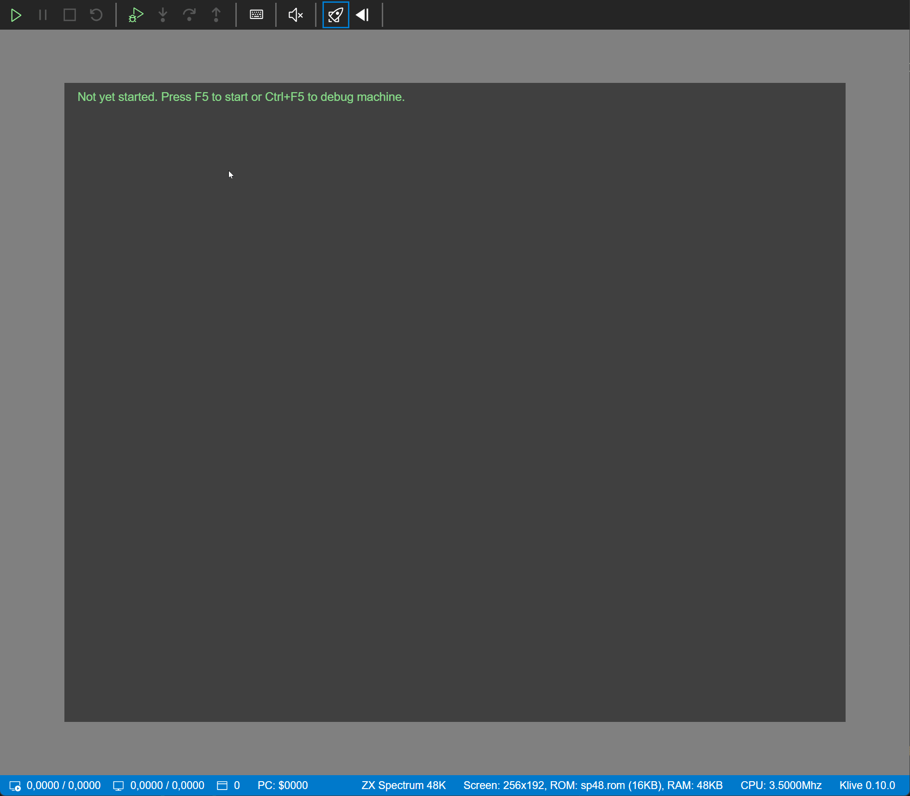

# Klive IDE

This project aims to build a full-fledged Z80 assembler IDE that you can easily use on Linux, Mac, and Windows. Besides supporting the traditional ZX Spectrum models (48/128/2/2A/2+/3/3+),
Klive IDE intends to be an attractive development platform for [Cambridge Z88](https://en.wikipedia.org/wiki/Cambridge_Z88) and [ZX Spectrum Next](https://www.specnext.com/).

**The current public release (v0.9.0) is released on February 21, 2020 [(changelog)](https://github.com/Dotneteer/kliveide/releases)**.

- [You can immediately try it](https://dotneteer.github.io/kliveide/getting-started/install-kliveide)

## Approach

You may ask why we need another ZX Spectrum Emulator and IDE, as we have dozens of them. More or less, you are right. Nonetheless, we have only a few of ZX Spectrum Next emulators that support the developer community:

- [ZEsarUX](https://github.com/chernandezba/zesarux) by _Cesar Hernandez Bano_
- [CSpect](http://www.cspect.org/) by _Mike Dailly_

Cesar and Mike both did and still do a great job with their projects. There is a high likelihood that Klive will never catch up with their excellent emulators, at least not with their features.

 Nonetheless, this project offers these benefits to you:
1. **Features are mostly based on community expectations and feedback.** Of course, it does not mean that contributors will implement everything the community asks for, but we try to be driven by user (developer) voices.
2. **Open source code.** The source code is not only available for everyone but is well documented so that you can learn from it. It is an expectation from a contributor to provide decent documentation for any new feature or fix.
3. **Open for extensibility.** The design strives to allow you to add your custom pieces to the IDE.

## The IDE Concept

I've been working for more than three years on [SpectNetIDE](https://github.com/Dotneteer/spectnetide), which is a Visual Studio 2019 extension that includes a ZX Spectrum emulator and development tools. Though I like this project and will still develop it, it requires more investment (utilizing my free time) than I'm happy to spend:
- Visual Studio Extensibility is hard. Even if it's continuously getting easier, sometimes it still feels painful due to the lack of available samples and documentation.
- SpectNetIDE can be used only on Windows. No easy way to port it to Mac or Linux.

Klive IDE, on the other hand, targets Linux, Mac, and Windows. To use the IDE, you need these three software components:
- [**Visual Studio Code**](https://code.visualstudio.com/). The widely known and popular coding IDE that is available on multiple platforms.
- **The Klive ZX Spectrum Emulator**. An Electron-Shell based ZX Spectrum emulator written in TypeScript and _native_ WebAssembly to be the host of your development projects. The emulator is designed especially for _integration_ with development tools.
- **The VS Code Extension for Klive IDE**. The extension that binds VS Code and the Klive emulator to provide seamless development and debug experience.

## Roadmap

The project is in its initial phase when we uses proof-of-concept modells to create the initial version. As of know, this is the roadmap &mdash; without any deadlines yet:

1. (**Mission accomplished**) The initial POC of the Klive emulator. Main things to gather experience:
    - Using web technologies to create a decent UI with a powerful emulator that provides space for excessive hardware emulation (ZX Spectrum Next) (&check;)
    - Ability to measure how WebAssembly plays its role on this area. (_Note_: So far measures show that the native WA implementation is about three times faster than the tuned JavaScript implementation.) (&check;)
    - An easy to use API to support integration with external apps, main focus on VS Code. (&check;)
2. (**Close to accomplishment**) A series of POC-pieces to find out which VS Code extensibility tools is best suited for particular components of the IDE:
    - Z80 Disassembly (&check;)
    - ZX Spectrum live memory map (&check;)
    - Z80 Assembly/Boriel's BASIC source code development experience (&check;)
    - Compilation (Z80 Assembler, Boriel's BASIC integration) &mdash; using/implementing an excellent Z80 Assembler (&check;)
    - Tape handling experience (&check;)
    - Z80/Boriel's BASIC source code/Z80 Disassembly debugging experience (breakpoints, stepping modes, watching register and symbol values, etc.)
3. The first public version of the Klive IDE with these features:
    - Running and debugging ZX Spectrum 48 code with the three software components working in orchestration.
    - Z80 Assembly integration (syntax highlighting and compilation) (&check;)
4. A Klive IDE version that provides feature-parity with SpectNetIDE
5. Implementing Cambridge Z88 emulator (_in progress_)
6. Moving toward ZX Spectrum Next (_in progress_)

## Contact me

You can directly contact me: dotneteer@hotmail.com
For discussions, join the Telegram group at https://t.me/kliveide

