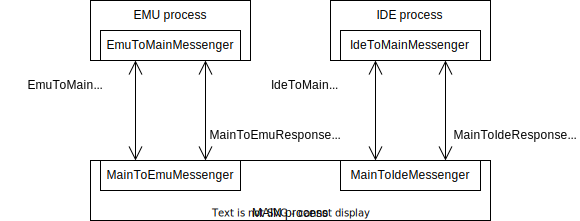

# Klive IDE

## Source code structure

This figure shows the source code structure of the project (essential files and folders only):

```
|-- _docs: temporary files for documentation
|-- .vscode: VS Code setting
|-- dist: distribution files for the Electron renderer process (not committed to repo)
|-- node_modules: node files (not commited to repo)
|-- dist-electron: distribution files for the Electron renderer process (not committed to repo)
|-- public: public resources used by the main and renderer processes
|-- release: released build files (not committed to repo)
|-- src: the root folder of all source code files
    |-- common: common code available in the main and renderer processes
    |-- electron: resources and other files (no code files) related to Electron Build
    |-- emu: Th ZX Spectrum Emulator core
    |-- lib: source code of external libraries used within the project
    |-- main: the source code of the Electron main process
    |-- renderer: the source code of the Electron renderer process
    |-- main.tsx: the entry point of the EMU and IDE renderer processes
|-- test: the root folder for all test files
|-- index.htlm: the start file for both renderer (EMU and IDE) processes
|-- package.json: the package file of the project
|-- tsconfig.json: the renderer processes' TypeScript configuration
|-- tsconfig.node.json: the main process's TypeScript configuration
|-- vite.config.js
```

## Electron processes

Klive IDE utilizes three processes following the Electron architecture:
- The **main** process (used in Node.js) accesses machine resources, such as files directly. This process displays the main menu and initiates menu command execution by sending messages to the EMU and IDE processes. This process holds the Z80 Assembler that compiles the Klive IDE code to binary content.
- The **EMU** renderer process displays a window with the ZX Spectrum Emulator and related UI. This process runs the emulator entirely. During machine setup, it communicates with the main process to obtain the necessary resources (e.g., ROM files).
- The **IDE** renderer process displays a window with the development environment UI. This process communicates with the main process to get resources and the emulator process to obtain machine information to show in the IDE.

Though Klive has two renderer processes, they share the same source code. When the renderer processes start, they check their URL's for the `?emu` and `?ide` query parameters to decide whether they display the EMU or the IDE UI.

This check is in the `src/main.tsx` file. The UI creates an `EmuApp` or an `IdeApp` React component according to the query parameter.

## State management

Klive IDE uses the redux-style state management. Each process contains an up-to-date store with the actual application state. Each process (main, EMU, and IDE) may initiate state changes through reducer actions. Whenever a store's state changes due to an action, the action is forwarded to the other processes so that those can update their state.

The `src/common/state` folder contains all files for state management. State changes are conveyed through the Electron IPC mechanism with a message type of `ForwardAction`. Each process has its infrastructure to send messages and process incoming message requests.

The following figure depicts this communication; it displays the message channel names (arrows) and the messaging class names (boxes):


