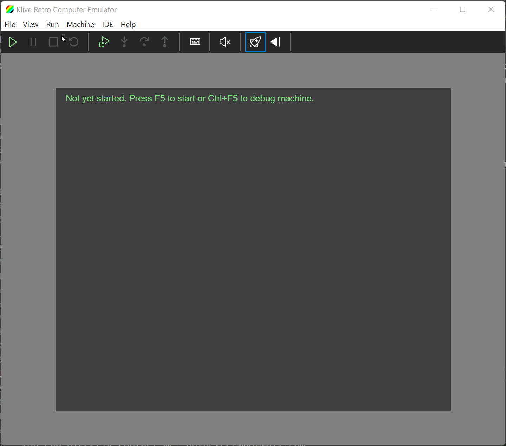

# Klive IDE

This project aims to build a retro computer IDE that you can run on Linux, Mac, and Windows. Though currently, Klive IDE supports only the Z80 CPU, a few ZX Spectrum models (48/128/2/2A), it intends to be an attractive development platform for other Z80-based microcomputers [Cambridge Z88](https://en.wikipedia.org/wiki/Cambridge_Z88) and [ZX Spectrum Next](https://www.specnext.com/). In the future, provided the community supports, Klive IDE may involve other CPUs and retro computers.

Klive is now a standalone application that contains an emulator and an IDE.

> Note: The previous versions of Klive were integrated with Visual Studio Code. Although initially, it seemed to be a good idea, this solution has issues coming from the integration and communication between VS Code and Klive.

## The IDE Concept In a few Videos

### Running ZX Spectrum 48K In the Emulator

### Loading A ZX Spectrum Game

### Fast Tape Loading

## Contact me

You can directly contact me: dotneteer@hotmail.com
For discussions, join the Telegram group at https://t.me/kliveide

