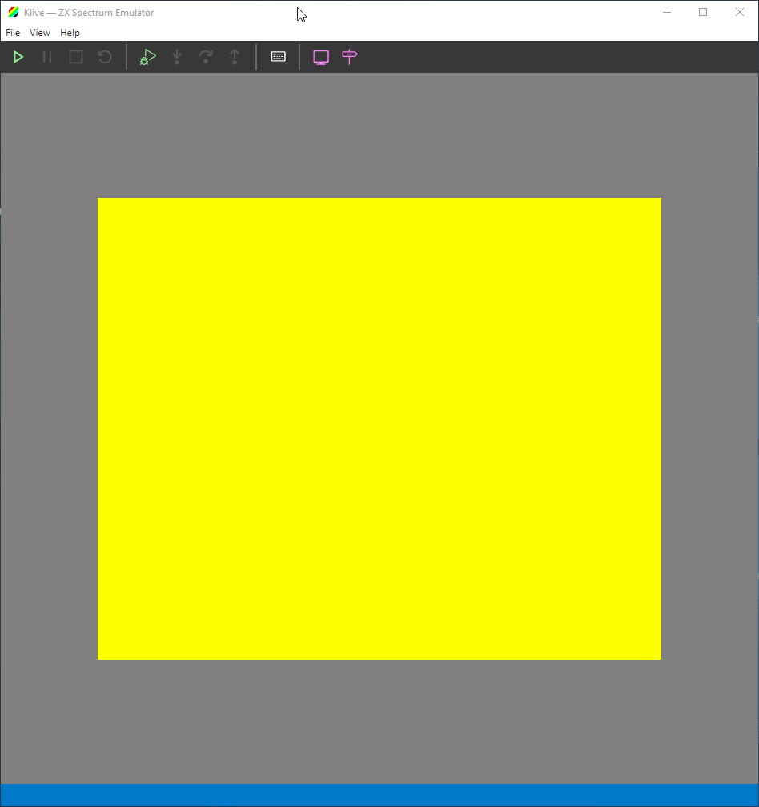
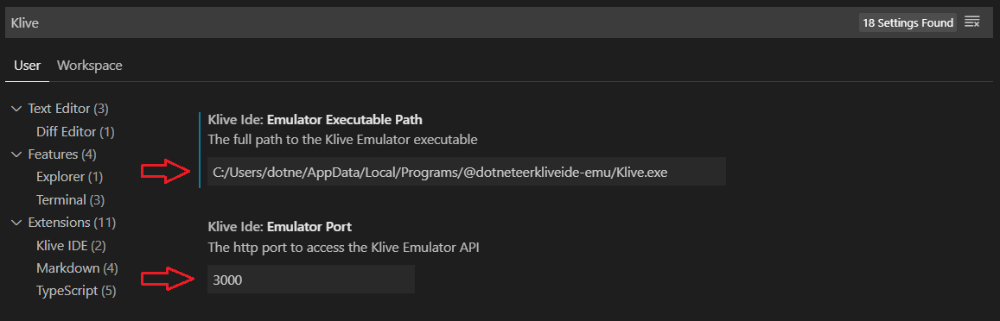
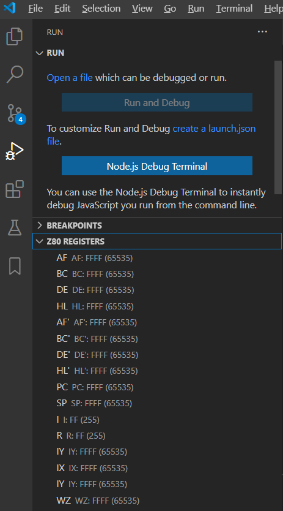
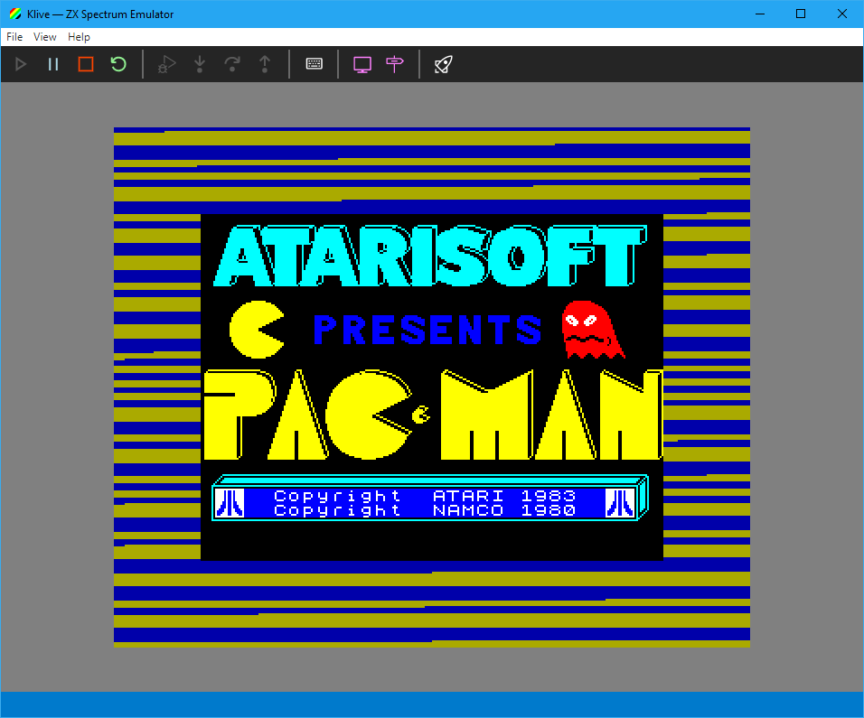
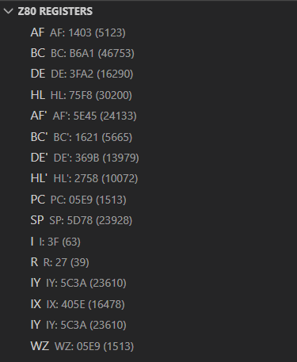

# Klive IDE

This project aims to build a full-fledged ZX Spectrum IDE that you can easily use on Linux, Mac, and Windows. Besides supporting the traditional ZX Spectrum models (48/128/2/2A/2+/3/3+), Klive IDE intends to be an attractive development platform for [ZX Spectrum Next](https://www.specnext.com/).

**The first public release (v0.1.0) is released on August 2, 2020**. [You can immediately try it](#try-release).

[You can build the latest commit](#build-it).

## Approach

You may ask why we need another ZX Spectrum Emulator and IDE, as we have dozens of them. More or less, you are right. Nonetheless, we have only a few with ZX Spectrum Next emulators that support the developer community:

- [ZEsarUX](https://github.com/chernandezba/zesarux) by _Cesar Hernandez Bano_
- [CSpect](http://www.cspect.org/) by _Mike Dailly_

Cesar and Mike both did and still do a great job with their projects. There is a high likelihood that Klive will never catch up with their excellent emulators, at least not with their features.

 Nonetheless, this project offers these benefits to you:
1. **Features are mostly based on community expectations and feedback.** Of course, it does not mean that contributors will implement everything the community asks for, but we try to be driven by user (developer) voices.
2. **Open source code.** The source code is not only available for everyone but is well documented so that you can learn from it. It is an expectation from a contributor to provide decent documentation for any new feature or fix.
3. **Open for extensibility.** The design strives to allow you to add your custom pieces to the IDE.

## The IDE Concept

I've been working for more than three years on [SpectNetIDE](https://github.com/Dotneteer/spectnetide), which is a Visual Studio 2019 extension that includes a ZX Spectrum emulator and development tools. Though I like this project and will still develop it, it requires more investment (utilizing my free time) than I'm happy to spend:
- Visual Studio Extensibility is hard. Even if it's continuously getting easier, sometimes it still feels pain due to the lack of available samples and documentation.
- SpectNetIDE can be used only on Windows. No easy way to port it to Mac or Linux.

Klive IDE targets Linux, Mac, and Windows. To use the IDE, you need these three pieces of software:
- [**Visual Studio Code**](https://code.visualstudio.com/). The widely known and popular coding IDE that is available on multiple platforms.
- **The Klive ZX Spectrum Emulator**. An Electron-Shell based ZX Spectrum emulator written in TypeScript and _native_ WebAssembly to be the host of your development projects. The emulator is designed especially for _integration_ with development tools.
- **The Klive IDE VS Code Extension**. The extension that binds VS Code and the Klive emulator to provide seamless development and debug experience.

## Roadmap

The project is in its initial phase when we uses proof-of-concept modells to create the initial version. As of know, this is the roadmap &mdash; without any deadlines yet:

1. (**Mission accomplished**) The initial POC of the Klive emulator. Main things to gather experience:
    - Using web technologies to create a decent UI with a powerful emulator that provides space for excessive hardware emulation (ZX Spectrum Next) (&check;)
    - Ability to measure how WebAssembly plays its role on this area. (_Note_: So far measures show that the native WA implementation is about three times faster than the tuned JavaScript implementation.) (&check;)
    - An easy to use API to support integration with external apps, main focus on VS Code. (&check;)
2. A series of POC-pieces to find out which VS Code extensibility tools suit the best for particular pieces of the IDE:
    - Z80 Disassembly
    - ZX Spectrum live memory map
    - Z80/Boriel's BASIC source code/Z80 Disassembly debugging experience (breakpoints, stepping modes, watching register and symbol values, etc.)
    - Z80 Assembly/Boriel's BASIC source code development experience
    - Compilation (Z80 Assembler, Boriel's BASIC integration) &mdash; using/implementing an excellent Z80 Assembler
    - Tape handling experience
3. The first public version of the Klive IDE with these features:
    - Running and debugging ZX Spectrum 48 code with the three software components working in orchestration.
    - Z80 Assembly integration (syntax highlighting and compilation)
4. A Klive IDE version that provides feature-parity with SpectNetIDE
5. Moving toward ZX Spectrum Next

## Installing and Running Release v0.1.0

> **Note**: This release runs only on Windows. Not as if the source code were Windows-specific, it supposed to support Linux, Mac, and Windows. I do not have a Mac to build this product, as I miss some crucial experiences with Linux. **I'm looking for contributors who could help me with building for the other platforms.**

To install the early preview release, follow these steps:

1. **Make sure that Visual Studio Code is installed on your computer.** If not, or it is older than v1.46.0, visit https://code.visualstudio.com/download for the newest version.
2. Download the `KliveSetup-0.1.0.exe`, and `kliveide-vsext-0.1.0.vsix` files from [Release v0.1.0](https://github.com/Dotneteer/kliveide/releases/tag/v0.1.0).
3. Install the standalone **Klive Emulator** by running `KliveSetup-0.1.0.exe`. Windows may display a security message about risks&mdash;ignore that and install the app.
4. In the Windows search box, type `Klive`, and right-click the **Klive** app within the results. From the context menu, select "Open File Location".
5. Right-click the **Klive** shortcut, and open its properties. Copy the target file information (the entire path) from the dialog. On my machine, it looks like this: `C:\Users\dotne\AppData\Local\Programs\@dotneteerkliveide-emu\Klive.exe`. **On your machine, it will be different**. Save this information, as you need to use it soon.
6. Open Visual Studio Code, and open any folder as a project. It does not matter which one you open, but you need an open folder for the demo.
7. Select the Extensions tab in the activity bar (the leftmost vertical panel in VS Code) . Above the list of the extensions, in the EXTENSIONS header, click the menu, and select **Install from VSIX...**. When the dialog opens, select and install the `kliveide-vsext-0.1.0.vsix` file, and then reload VS Code.
8. Click the settings icon in VS Code's activity bar, and select the **Settings** menu command. You must set the **Emulator Executable Path** value to the one you saved in Step 5. Please, change all backslash characters to slashes, and do not forget to include the executable name. Make sure that the **Emulator Port** value is set to 3000, as this proof-of-concept works only with this port.
9. In VS Code, press Ctrl+Shift+P, or F1 (or if those do not work on your machine, use the **View|Command Palette...** menu). In the command box, type "Start Klive", and then run the **Start Klive Emulator** command.

10. In a few seconds, it will pop up the Klive Emulator app. If not, check again that you set the right path in Step 8.
11. In the activity bar, select the Debug tab. At the bottom, it will display the **Z80 REGISTERS** view.

12. In the Klive Emulator, start the ZX Spectrum virtual machine (click Start on the toolbar). You can see that the register values are continuously updated.
13. Type the **LOAD ""** command in the emulator, and press (click) Enter. (You can display the keyboard with the corresponding button on the toolbar.) 

14. The emulator starts loading the Pac-Man game (it does not provide sound during the load, but this missing feature will be added soon.) You can check that VS Code refreshes the register values.

15. Play with the virtual emulator :-)

## Building Klive IDE

This repository is a monorepo with two packages and uses [Lerna](https://github.com/lerna/lerna) for managing them. In the future, the repo may have additional packages.

Prepare the code for build and run:

1. Fork this repository, and clone it.
2. Run `npm run bootstrap` to install and setup the packages.
3. Open the project folder in VS Code (or in your preferred coding tool). Take care that the current working directory (as always) should be the project folder.

Follow these steps to build and run the Klive Emulator in development mode:

1. Start a new command-line program (a terminal window in VS Code), and execute the `npm run dev`. It will build the Klive Emulator and starts the Webpack development server that continuously watches for code changes. The server runs until you terminate this process. To run Klive Emulator, keep this process alive.
2. Start *another* command-line prompt (terminal window), and run the emulator with `npm start`.
3. When you have completed playing with it, close the emulator, and then terminate the open command-line prompts.

> Note: Wait while the `npm run dev` command completes the build; otherwise, the `npm start` command will fail.

These steps help to build and install Klive Emulator:

1. On Windows, execute the `npm run build:win` command. On Mac, run `npm run build:mac`; or `npm run build:linux` on Linux. In a few minutes, these commands prepare the Klive setup kit.
2. Open the `packages/kliveide-emu/out` folder in your preferred file manager tool. In VS Code, you can right-click this folder in the Explorer pane and select the **Reveal in File Explorer** command.
3. Start the `KliveSetup-<version>.exe` app within this folder. It runs the setup kit and then starts Klive Emulator.

With a few additional steps, you can try the Klive VS Code extension:

1. If you use the development mode, start a second Visual Studio Code, and open the `packages/kliveide-vsext` folder within the project folder. If you do not, complete the build steps of Klive Emulator, and **take care that the emulator runs** while playing with the VS Code extension.
2. Press Ctrl+F5 (**Run|Run Without Debugging** command). In a few seconds, VS Code builds the extension and starts a new VS Code instance (Extension Development Host).
3. Select the Debug tab in VS Code's activity bar. This action displays the **Z80 REGISTERS** view at the bottom. *Unless you visit this tab, VS Code does not load the Klive IDE extension.
4. Alternatively, you can run the **Start Klive Emulator** command with F1 or Ctrl+Shift+P (or **View|Command Palette**).
5. Play with the emulator. As you run it, you can observe that Z80 register's values are periodically refreshed (see the value of R register).

