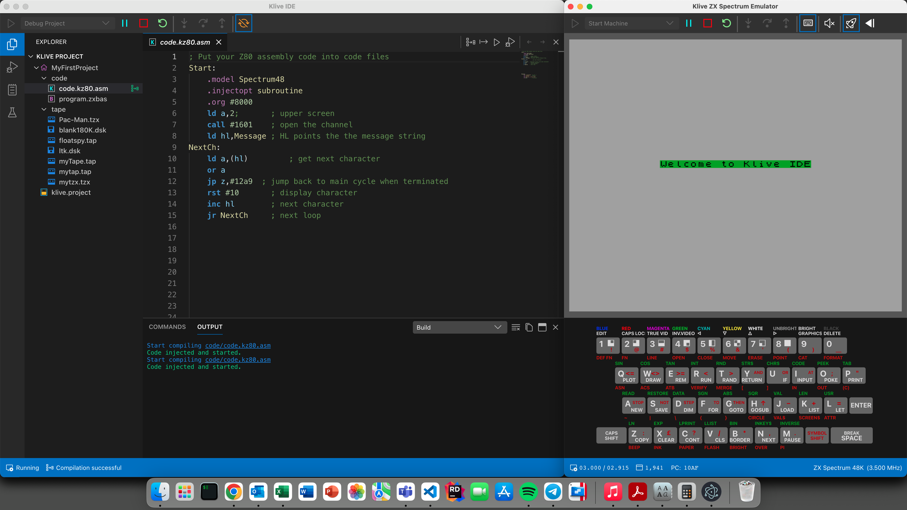

<div align="center">


# Klive IDE

### A retro computer emulator and IDE for Z80 lovers — on Mac, Windows, and Linux

[](https://github.com/Dotneteer/kliveide/releases)
[](LICENSE)
[](#technology)
[](#-community--contributing)

</div>

---

> **Klive IDE** is a cross-platform emulator and full-featured Integrated Development Environment for  
> Sinclair Z80-based retro computers. It is built by retro-computing enthusiasts, for retro-computing enthusiasts.  
> Write Z80 Assembly, ZX BASIC (Boriel's Basic), or SJASMPLUS; hit one button, and watch your code run—or step through it—right inside  
> the emulated machine. No setup ceremony. Just you and the pixels.

---

## Table of Contents

- [Screenshots](#-screenshots)
- [Supported Machines](#-supported-machines)
- [Emulator Features](#-emulator-features)
- [Screen Recording](#-screen-recording)
- [IDE Features](#-ide-features)
- [Programming Languages](#-programming-languages)
- [Scripting](#-scripting)
- [Getting Started](#-getting-started)
- [Technology](#-technology)
- [Community & Contributing](#-community--contributing)

---



---

## 💻 Supported Machines

Klive targets retro computers built around the Z80 CPU family. Each machine is emulated cycle-accurately with its authentic ROM and hardware behaviour.

| Machine                   | Status          | Notes                                                |
| ------------------------- | --------------- | ---------------------------------------------------- |
| **ZX Spectrum 48K**       | ✅ Active       | PAL, NTSC, and 16K models                            |
| **ZX Spectrum 128K**      | ✅ Active       | Full 128K memory paging                              |
| **ZX Spectrum +2E / +3E** | ✅ Active       | Single and dual floppy drive models                  |
| **Cambridge Z88**         | ✅ Active       | Multiple OZ OS versions (3.x – 5.0), various locales |
| **ZX Spectrum Next**      | 🔄 In progress  | KS2 model; extended Z80 instruction set              |
| **Commodore 64**          | 🧪 Experimental | Early stage; 6510 CPU                                |
| **ZX 80 / ZX 81**         | 🗓️ Planned      | —                                                    |

---

## 🕹️ Emulator Features

### Machine Control

Run, pause, continue, restart, and stop the emulated machine at any time—without restarting the application. Toggle between normal and debug run modes on the fly.

| Keyboard Shortcut | Action               |
| ----------------- | -------------------- |
| `F5`              | Start machine        |
| `Shift+F5`        | Pause machine        |
| `F4`              | Stop machine         |
| `Shift+F4`        | Restart machine      |
| `Ctrl+F5`         | Start with debugging |
| `F10`             | Step Into            |
| `F11`             | Step Over            |
| `Shift+F11`       | Step Out             |

- **CPU clock multiplier** — run at 1× to 24× native speed for rapid testing
- **Sound control** — enable, mute, or adjust the audio level at any time

### Debugging Views

| View                     | What it shows                                                                                                                                                            |
| ------------------------ | ------------------------------------------------------------------------------------------------------------------------------------------------------------------------ |
| **CPU View**             | All Z80 registers (AF, BC, DE, HL, SP, IX, IY, I, R), interrupt mode, halt state, internal WZ/MEMPTR register, T-state counter, last memory read/write and I/O addresses |
| **ULA View**             | Full ULA state                                                                                                                                                           |
| **Memory View**          | Live hex+ASCII memory explorer with bank selection; edit RAM contents while the machine is paused or running                                                             |
| **Disassembly View**     | Live disassembly scrolling with the PC; navigate banked memory pages                                                                                                     |
| **Breakpoints Panel**    | All active breakpoints with type, address, resolved/unresolved status, and enable/disable toggle                                                                         |
| **Watch Panel**          | Monitor named variables with configurable data types (8-bit, 16-bit, 32-bit, flags, strings, arrays)                                                                     |
| **BASIC Listing Viewer** | Displays the BASIC program currently in the emulator's memory; toggleable non-printable characters, ZX Spectrum font, and corruption detection                           |
| **System Variables**     | Inspect live system variable values |

### Loading Programs

- **Tape files** (`.tap`, `.tzx`) with full format parsing
- **Fast load** — ROM-hook technique; loads tape files in a fraction of a second instead of the real tape time
- **Disk files** (`.dsk`) on ZX Spectrum +3E with single or dual drive models
- Manual tape rewind and control

### Virtual Keyboard

- **ZX Spectrum 48K**, **ZX Spectrum 128K**, **Cambridge Z88**, and **ZX Spectrum Next** keyboard overlays
- Fully clickable with a mouse; multi-key and Symbol Shift combinations supported
- Resizable to suit your screen layout

---

## 🎬 Screen Recording

Capture the emulator screen (plus stereo audio) directly to video files. Perfect for sharing gameplay, creating tutorials, or archiving your retro work.

- **One-click armed recording** — arm the recorder, start the machine, recording begins instantly
- **Flexible output** — choose MP4, WebM, or MKV; adjust quality and frame rate to balance file size
- **Automatic sync** — audio and video stay perfectly synchronized even during pause/resume
- **Seamless integration** — recordings are saved automatically; files are ready to share

FFmpeg is bundled with Klive — no separate install needed.

> **Full guide:** [Recording the Emulator Screen](https://dotneteer.github.io/kliveide/howto/screen-recording)

---

## 🛠️ IDE Features

### One-Click Compile, Inject, and Debug

Klive's signature feature: a single toolbar button takes your source code from the editor to running (or debugging) inside the emulated machine.

| Button      | What it does                                            |
| ----------- | ------------------------------------------------------- |
| **Compile** | Checks code syntax and reports errors                   |
| **Inject**  | Compiles and injects machine code into a paused machine |
| **Run**     | Compiles, injects, and starts the code immediately      |
| **Debug**   | Compiles, injects, and starts with breakpoints active   |

The automated pipeline restarts the machine, injects the compiled bytes at the correct address, sets the program counter, and begins execution—all in one click.

### Monaco-Based Code Editor

Klive's editor is powered by the same Monaco engine that runs VS Code, giving you:

- **Full VS Code keyboard shortcuts** — multi-cursor editing, find/replace with regex, go-to-symbol, and more
- **Code folding** for assembly blocks (`.macro`/`.endm`, `.if`/`.endif`, etc.)
- **Minimap** with error and warning markers
- **Auto-indentation** and bracket/quote auto-closing

### Semantic Syntax Highlighting

Unlike most assembler editors, Klive's syntax highlighting is driven by the compiler itself—not just regex patterns. Every token is coloured according to what it actually means:

- **Labels**, **macros**, **struct names**, **`.equ` constants**, **variables**, and **macro parameters** each get distinct colours
- Inline **error diagnostics** with red underlines and hover tooltips
- **Macro expansion preview** on hover—see the expanded code before it assembles

### Additional Editor Intelligence

- **Address & byte-count tooltips** — hover over any instruction to see its assembled address and the resulting machine code bytes
- **Inlay hints** showing hex/decimal equivalents of numeric literals side-by-side in the source
- **Color decorators** for `attr()`, `ink()`, `paper()` functions with an integrated colour picker
- **Block-pair highlighting** for matching keywords
- **Rename symbol (F2)** with cross-file refactoring
- **Go to included file** navigation

### Project Management

A Klive project is a folder containing a `klive.project` config file plus your source files. The **Project Explorer** gives you a tree view with:

- **Build root designation** — mark the main file for compilation
- **Per-extension file associations** — each file type opens in the right viewer automatically:
  - `.kz80.asm` → Klive Z80 Assembly editor  
  - `.zxbas` → ZX BASIC (Boriel's Basic) editor  
  - `.sjasm` → SJASMPLUS Assembly editor  
  - `.6510.asm` → 6510 Assembly editor
  - `.ksx` → Klive Script editor
  - `.tap` / `.tzx` → Tape viewer
  - `.dsk` → Disk viewer
  - `.nex` → NEX file viewer
  - `.bin` / `.rom` → Binary hex dump viewer
  - `.png`, `.jpg`, `.gif`, `.svg`, … → Image viewer

### Code Export

Compile your project and export it for use outside Klive or for distribution:

- Export to **`.tap`**, **`.tzx`**, or **Intel HEX** format
- Automatic **BASIC loader generation** (with optional `CLEAR` and `PAUSE 0` statements)
- Customisable **border colour** during loading screen
- Optional **loading screen** (`.scr`) file inclusion
- **Multi-bank code** support for ZX Spectrum 128K and +3E

### Interactive Command Panel

Press `F1` (or `Cmd+Shift+P`) to open the built-in CLI panel. A sample of what you can do:

```
bp $8000          ; set a breakpoint at address $8000
bp-list           ; list all active breakpoints
w-add score:u16   ; add a 16-bit watch on the 'score' symbol
show-memory       ; display memory contents
compile           ; compile the current project
debug             ; compile and start debugging
crd +3 bootdisk   ; create a new .dsk file
```

Full command reference: [commands-reference](https://dotneteer.github.io/kliveide/commands-reference)

---

## 💻 Programming Languages

Klive supports multiple Z80-based programming languages and assemblers, each with its own strengths:

### Klive Z80 Assembler (`.kz80.asm`)

Klive's native assembler, purpose-built for the IDE with tight integration and one-click compile-and-debug:

**Standout Features:**
- **Semantic highlighting** driven by the compiler, not just regex patterns
- **One-click debugging** — compile, inject, and debug directly inside the emulator
- **Compile-time control flow** — `.loop`, `.repeat`, `.while`, `.for` for generating optimal machine code
- **Powerful macros** with named parameter substitution (`{{paramName}}`)
- **Address and byte-count tooltips** — see assembled addresses and machine code on hover
- **Fast compilation** (~10,000 lines per second)
- **Full Z80 and ZX Spectrum Next instruction sets** including undocumented opcodes

See [⚙️ Klive Z80 Assembler](#️-klive-z80-assembler-detailed) below for full feature breakdown.

### ZX BASIC – Boriel's Basic (`.zxbas`)

A modern BASIC dialect for ZX Spectrum with modern language features (pointers, arrays, custom types) while remaining true to Spectrum roots:

**Features:**
- Write BASIC on a modern editor (full syntax highlighting and code editing)
- Compile to efficient Z80 machine code
- Seamless one-click compile-and-run in Klive
- Rich error messages and diagnostics
- Standard Spectrum BASIC compatibility
- Extended library functions

### SJASMPLUS (`.sjasm`)

For developers familiar with the SJASMPLUS assembler format, Klive integrates third-party SJASMPLUS compilation:

**Features:**
- Support for SJASMPLUS syntax and directives
- Automatic compilation and linking with Klive's build system
- One-click compile-and-debug with Klive's emulator
- Compatible with existing SJASMPLUS projects
- Rich syntax highlighting for `.sjasm` files

> **Note:** Both ZX BASIC and SJASMPLUS rely on external toolchains; the Klive Z80 Assembler is built-in with no external dependencies.

---

## ⚙️ Klive Z80 Assembler (Detailed)

Klive ships with a purpose-built Z80 assembler that goes well beyond basic instruction encoding.

### Instruction Set

- **Full Z80 instruction set** including undocumented registers (`ixl`, `ixh`, `iyl`, `iyh`) and instructions
- **ZX Spectrum Next extended instruction set** (MULUW, NEXTREG, PIXELAD, …)
- Multiple supported syntaxes for every directive (`.org`, `org`, `.ORG`, `ORG` all work)

### Rich Literal Formats

```asm
; Decimal, hex, binary — pick your style
ld a, 42
ld a, $2A
ld a, 0x2A
ld a, 2Ah
ld a, %00101010
ld a, 0b0010_1010    ; underscores for readability
```

### Compile-Time Control Flow

Write cleaner code using compile-time loops and conditionals that run during assembly—not at runtime:

```asm
; Unroll a loop at compile time
.loop 8
  rlca
.endl

; Conditional compilation by target model
#ifmod SPECTRUM48
  ; 48K-specific code
#endif

; Include another file
#include "macros/video.asm"
```

### Powerful Macro System

Unlike simple text-substitution macros, Klive macros use named parameter placeholders and are expanded by the compiler with full semantic awareness:

```asm
; Define a macro
SetBorderColor .macro(color)
  ld a, {{color}}
  out ($FE), a
.endm

; Use it
SetBorderColor(2)   ; assembles as: ld a, 2 / out ($FE), a
```

### Assembler Directives Reference

| Category                  | Directives                                                 |
| ------------------------- | ---------------------------------------------------------- |
| **Origin & layout**       | `.org`, `.xorg`, `.disp`, `.bank`                          |
| **Entry points**          | `.ent`, `.xent`                                            |
| **Data**                  | `.db`, `.dw`, `.dd`, `.defs`                               |
| **Constants & variables** | `.equ`, `.var`                                             |
| **Conditional**           | `#if`, `#ifdef`, `#ifndef`, `#ifmod`, `#define`, `#undef`  |
| **Control flow**          | `.loop`, `.repeat`/`.until`, `.while`, `.for`, `.if`       |
| **Scope**                 | `.proc`/`.endp`, `.module`/`.endmodule`, `.struct`/`.ends` |
| **Model**                 | `.model` (SPECTRUM48, SPECTRUM128, SPECTRUMP3, NEXT)       |

---

## 📜 Scripting

Klive includes a lightweight scripting engine for automating development tasks. Script files use the `.ksx` extension and run JavaScript-like syntax directly within the IDE.

```js
// build.ksx — custom build script
async function runCode() {
  await $command("compile");
  $log("Build complete, loading into emulator...");
  await $command("run");
}
```

### Scripting API Highlights

| Function              | Purpose                  |
| --------------------- | ------------------------ |
| `$command(cmd)`       | Execute any IDE command  |
| `$log(msg)`           | Write to the Output Pane |
| `$progress(pct, msg)` | Display a progress bar   |

- Full access to JavaScript built-ins: `Math`, `Number`, `String`, `Date`, `JSON`, etc.
- **Scripting History** panel showing the last 50 executed scripts
- Debug mode for scripts: set breakpoints inside `.ksx` files
- Override `buildCode()`, `injectCode()`, `runCode()`, `debugCode()`, `exportCode()` in `build.ksx` to fully customise your build pipeline

---

## 🚀 Getting Started

### Download and Install

| Platform    | Installer                                                                     |
| ----------- | ----------------------------------------------------------------------------- |
| **macOS**   | PKG installer (allow in System Settings → Privacy & Security on first launch) |
| **Windows** | Self-extracting EXE (x64)                                                     |
| **Linux**   | AppImage (requires FUSE libraries)                                            |

Latest release: [GitHub Releases](https://github.com/Dotneteer/kliveide/releases)  
Full documentation: [dotneteer.github.io/kliveide](https://dotneteer.github.io/kliveide/)

### First Steps

1. Launch Klive — the **Emulator** window opens showing the machine screen
2. Open the IDE via **View → Show IDE**
3. Create a new project: **File → New Project**, pick a machine and template
4. Write code in the editor; mark your main file as the **build root**
5. Click **Run** — your code compiles, injects, and executes immediately
6. Click **Debug** to step through with breakpoints

### Building from Source

```bash
git clone https://github.com/Dotneteer/kliveide.git
cd kliveide
npm install
npm run dev
```

---

## 🔧 Technology

Klive is written entirely in **TypeScript** and runs on:

- **[Electron](https://www.electronjs.org/)** — native desktop shell
- **[React](https://react.dev/)** — UI rendering
- **[Monaco Editor](https://microsoft.github.io/monaco-editor/)** — the VS Code editor engine
- **[Vite](https://vitejs.dev/)** + **[electron-vite](https://electron-vite.org/)** — build toolchain

The Z80 emulation core, assembler, and all machine emulators are implemented from scratch in TypeScript—no C++ native modules required.

---

## 🤝 Community & Contributing

This project is a **passion project**, born from a love of retro computing. My first computer was a ZX81, followed by a ZX Spectrum 48K. Klive is my way of honoring that legacy—not for profit, but for the joy of creation and connection with fellow enthusiasts.

Whether you want to fix a typo, improve documentation, squash a bug, add a new machine, or propose a new feature—**every contribution is welcome and appreciated**.

The codebase is entirely TypeScript (Electron + React), so if you know modern JavaScript/TypeScript you already have the tools to contribute.

**Feel free to reach out:** dotneteer@hotmail.com

### Contributors

A heartfelt thank-you to these amazing people:

| Contributor                                                                   | Contribution                                                       |
| ----------------------------------------------------------------------------- | ------------------------------------------------------------------ |
| [bits4fun](https://github.com/bits4fun)                                       | Inspired the project; helped bring Cambridge Z88 emulation to life |
| [vrishe](https://github.com/vrishe)                                           | New IDE features and bug-squashing wizardry                        |
| [TheStruggleForAntiSpaghetti](https://github.com/TheStruggleForAntiSpaghetti) | Thoughtful suggestions, testing, and stability improvements        |
| [Pete-L-72](https://github.com/Pete-L-72)                                     | Testing and helping shape a more stable IDE                        |

---

## 📋 Roadmap Highlights

- [ ] ZX 80 / ZX 81 emulation
- [ ] ZX Spectrum Next (KS2) — complete emulation
- [ ] Custom machine ROMs
- [ ] Memory read/write breakpoints with hit-count conditions
- [ ] I/O read/write breakpoints
- [ ] Integration with external assemblers (with optional source-level debug)
- [ ] Conditional breakpoints

---

<div align="center">

Made with ❤️ for the retro-computing community

[Documentation](https://dotneteer.github.io/kliveide/) · [Releases](https://github.com/Dotneteer/kliveide/releases) · [Issues](https://github.com/Dotneteer/kliveide/issues) · [Discussions](https://github.com/Dotneteer/kliveide/discussions)

</div>
