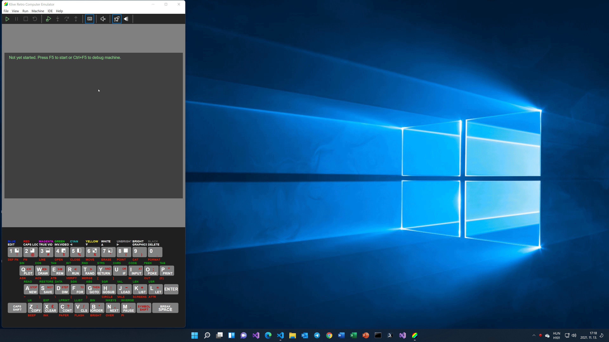

  

    

      

        <h2 class="feature">About the Project</h2>
        

          This project aims to build a retro computer IDE that you can run on Linux, Mac, and Windows. Though currently, Klive IDE supports only the Z80 CPU, a few ZX Spectrum models (48/128/2/2A), it intends to be an attractive development platform for other Z80-based microcomputers <a href="https://en.wikipedia.org/wiki/Cambridge_Z88">Cambridge Z88</a> and <a href="https://www.specnext.com/">ZX Spectrum Next</a>. In the future, provided the community supports, Klive IDE may involve other CPUs and retro computers.
        

        

          <a href="#contribution">I'm looking for contributors!</a>
        

      

    

  

  

    

      

        <h2 class="feature">The Klive Concept</h2>
        

          Klive is a standalone application using the Electron shell, which contains an emulator to 
          run retro computers and an IDE to develop games and other applications.

        

          Currently, Klive supports these retro computers:
        

        <ul>
          <li>ZX Spectrum 48K</li>
          <li>ZX Spectrum 128K/2/+2</li>
          <li>Cambridge Z88</li>
        </ul>
        

          The entire project uses React, TypeScript, and WebAssembly. The app's architecture is designed and built with extensibility in mind. The final architecture will make it easy to add new CPU and retro computer types and tools.
        

      

      

        
      

    

  

  

    

      

        <h2 class="feature">The Emulator and the IDE</h2>
        

          Klive provides two separate main windows; one with the emulator and another for the IDE. This arrangement allows you to use multiple monitors when developing applications.
        

        

          The IDE contains a debugger that you can use to work with binary code (e.g., a game loaded from tape or disk) and source code when developing your apps. 
        

        

          The built-in Z80 assembler compiles your source to machine code. Klive uses the Monaco code editor (the same as in Visual Studio Code) to provide an excellent editing experience.
        

        
      

    

  

  

    

      

        <h2 class="feature">Contribute</h2>
        

          I'm looking for contributors! If you want to be a part of developing a great retro computer tool, let me know.
        

        

          If you are not familiar with the technologies used within the project, but you're adept at Z80-based (and other) retro computer emulators and want to help me with your ideas and experience, you're welcome, too.
        

        

          You can contact me at <a href="mailto:dotneteer@hotmail.com">dotneteer@hotmail.com</a>.
        

      

    

  

