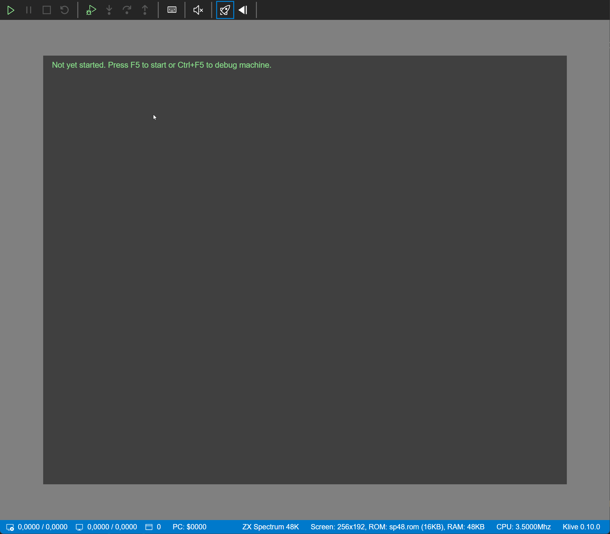

  

    

      

        <h2 class="feature">About the Project</h2>
        

          This project aims to build a full-fledged ZX Spectrum IDE that you can easily use on Linux, Mac, 
          and Windows. Besides supporting the traditional ZX Spectrum models (48/128/2/2A/2+/3/3+), Klive 
          IDE intends to be an attractive development platform for <a href="https://www.specnext.com/" target="_blank">ZX Spectrum Next</a>.
        

      

    

  

  

    

      

        <h2 class="feature">The IDE Concept</h2>
        

          I've been working for more than three years on <a href="https://github.com/Dotneteer/spectnetide" target="_blank">SpectNetIDE</a>,
          which is a Visual Studio 2019 extension that includes a ZX Spectrum emulator and development tools. Though I 
          like this project and will still develop it, it requires more investment (utilizing my free time) than I'm happy to spend:
        

        <ul>
          <li>
            Visual Studio Extensibility is hard. Even if it's continuously getting easier, sometimes it still feels pain 
            due to the lack of available samples and documentation.
          </li>
          <li>
            SpectNetIDE can be used only on Windows. No easy way to port it to Mac or Linux.
          </li>
        </ul>
        

          Klive IDE targets Linux, Mac, and Windows. To use the IDE, you need these three pieces of software:
        

        <ul>
          <li><a href="https://code.visualstudio.com/" target="_blank">Visual Studio Code</a></li>
          <li>The Klive ZX Spectrum Emulator</li>
          <li>The Klive IDE VS Code Extension</li>
        </ul>
      

      

        
      

    

  

  

    

      

        <h2 class="feature">Approach</h2>
        

          You may ask why we need another ZX Spectrum Emulator and IDE, as we have dozens 
          of them. More or less, you are right. Nonetheless, we have only a few with ZX 
          Spectrum Next emulators that support the developer community:
        

        <ul>
          <li><a href="https://github.com/chernandezba/zesarux" target="_blank">ZEsarUX</a> by <em>Cesar Hernandez Bano</em></li>
          <li><a href="http://www.cspect.org/" target="_blank">CSpect</a> by <em>Mike Dailly</em></li>
        </ul>
        

          Cesar and Mike both did and still do a great job with their projects. There is a high likelihood 
          that Klive will never catch up with their excellent emulators, at least not with their features.
        

        

          Nonetheless, this project offers these benefits to you:
        

        <ul>
          <li>
            <strong>Features are mostly based on community expectations and feedback.</strong>
            Of course, it does not mean that contributors will implement everything the community asks for, 
            but we try to be driven by user (developer) voices.
          </li>
          <li>
            <strong>Open source code.</strong>
            The source code is not only available for everyone but is well documented so that you can learn 
            from it. It is an expectation from a contributor to provide decent documentation for any new feature or fix.
          </li>
          <li>
            <strong>Open for extensibility.</strong>
            The design strives to allow you to add your custom pieces to the IDE.
          </li>
        </ul>
      

    

  

