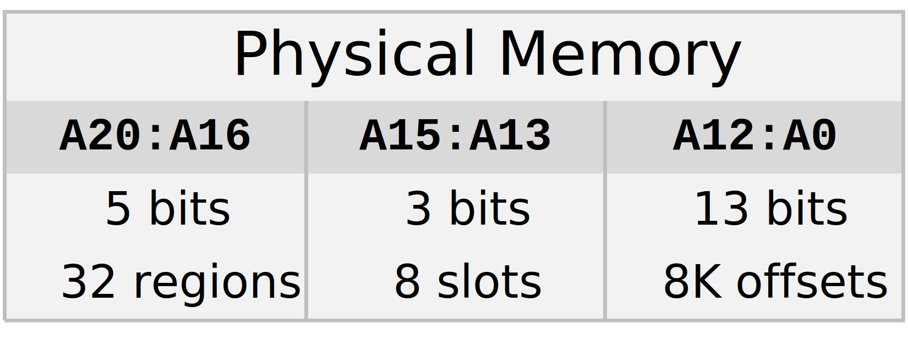

# ZX Spectrum Next Memory Management

The ZX Spectrum Next packs a whopping 2MB of memory - that's a lot for a retro machine! But here's the challenge: the Z80 CPU is stuck in 1976 with only 16 address lines, which means it can only "see" 64KB at a time. How do you give it access to all 2MB? Through some clever MMU (Memory Management Unit) magic that pages different chunks of that 2MB into the Z80's limited view.

Memory paging isn't new to the Spectrum family. The original 48K model was stuck with 48KB (16KB ROM + 32KB RAM), but later models expanded beyond the Z80's 64KB limit:

- **ZX Spectrum 128K** (1986): Added bank switching to access 128KB total (8 × 16KB banks)
- **ZX Spectrum +2/+3** (1987-1988): Also 128KB with slightly different ROM configurations
- **Russian clones** (Pentagon, Scorpion): Various memory expansion schemes up to 1MB

These machines used I/O ports (like 0x7FFD and 0x1FFD) to switch memory banks in and out of the Z80's visible address space. It worked, but the switching was coarse (whole 16KB banks) and the control was fiddly (write-only ports, special locking mechanisms to prevent accidents).

The Next keeps these legacy paging modes for compatibility - your old 128K software just works! But it also adds a modern MMU that's far more flexible: 8KB pages instead of 16KB banks, 224 usable pages instead of 8 banks, and straightforward NextReg registers instead of write-only I/O ports.

*Don't worry - I'll cover the legacy 128K paging modes later in this chapter when I discuss compatibility features. For now, I'm focusing on the Next's native MMU, which is what you'll use for new software.*

**Physical vs. Logical Memory**

Here's something that might surprise you: the Next doesn't have any ROM chips. Not one. Everything is SRAM (Static RAM) - all 2MB of it is physically writable. So when we say "ROM," we're lying to you (but in a helpful way).

**Physical Memory: It's All SRAM**

The Next has 2MB of SRAM chips. That's it. No ROM, no EPROM, no masked ROM from the factory. Everything lives in these 2MB (addresses 0x00'0000 to 0x1F'FFFF, requiring 21 address lines). Even the "ROM" that contains the firmware and operating system is just SRAM that's been told to act like ROM.

> **About the address notation**: You'll notice I use single quotes in long hexadecimal addresses (like `0x00'0000`). This groups the digits in sets of four from the right, making them much easier to read and parse visually. It's similar to how we write large decimal numbers with commas (1,234,567).

**Logical Memory: The Polite Fiction**

The memory controller creates a "logical" organization by selectively blocking writes to certain regions:
- Some regions are designated as "ROM" - they contain firmware and system code
- These "ROM" regions refuse write operations (write protection by the controller, not hardware)
- Other regions function as normal RAM with full read/write access
- The write protection can be disabled when needed (like updating firmware via NextReg 0x8C)

**Why This Matters:**

Let's say you're writing a program and accidentally try to write to address 0x0000. In a real ROM system, your write would disappear into the void. On the Next, the SRAM chip *could* be written to, but the memory controller steps in and says "nope, that's protected." Your program sees ROM-like behavior even though it's SRAM underneath.

But here's the clever bit: when you need to update the firmware, you can tell the memory controller (via NextReg 0x8C) to allow writes to those "ROM" regions. Suddenly the same memory becomes writable. Update complete, flip the protection back on, and you're good to go. No EPROM programmer required.

**What This Chapter Covers:**

I'm going to look at this memory system from an emulator implementer's perspective. That means understanding how the MMU translates those 16-bit Z80 addresses into 21-bit physical addresses, how the priority decode chain determines which memory responds to a request, and how to enforce those logical ROM/RAM boundaries even though everything is physically writable.

## Memory Map

The ZX Spectrum Next uses **21 address lines (A20:A0)** to access its 2MB of memory. Let's break that down:

- **21 bits** = $2^{21}$ = **2,097,152 bytes = 2MB** total addressable memory
- But the Z80 only has 16 address lines (A15:A0) - that's just 64KB
- Those extra 5 bits (A20:A16) come from the MMU, which acts like an address extender

Think of it like this: the Z80 is trying to navigate a huge city (2MB) with a map that only shows 64KB at a time. The MMU is like a GPS that says "oh, you want address 0x4000? Let me figure out which neighborhood (memory region) that's actually in."

### Address Line Breakdown: How 16 Bits Become 21



Let's decode this from left to right:

- **A20:A16 (5 bits)**: Which 64KB memory region? (0-31 possible regions)
- **A15:A13 (3 bits)**: Which MMU slot? (MMU0-MMU7 registers)
- **A12:A0 (13 bits)**: Offset within the 8K-bank (0-8191 bytes)

> **A quick note on terminology:** You'll notice I use "8K-bank" to refer to the 8KB memory chunks. The official ZX Spectrum Next documentation uses this term to distinguish from "16k-bank" (16KB chunks used by legacy 128K paging). However, be aware that the word "slot" can be confusing - it sometimes refers to the MMU slot (one of the eight 8KB windows in the Z80's address space, controlled by MMU0-MMU7 registers), and sometimes it's used informally to mean the 8K-bank itself. In this document, I use "slot" exclusively for the MMU registers (the windows), and "8K-bank" for the physical memory chunks.

**Here's the magic trick:**

When the Z80 wants to read from, say, 0x4000, here's what happens:

1. **Slot Selection**: Bits A15:A13 of 0x4000 are `010` (slot 2), so check MMU2 register
2. **8K-Bank Lookup**: MMU2 contains an 8-bit 8K-bank number - let's say 0x0A
3. **Address Translation**: The 8K-bank number 0x0A gets converted to physical address bits A20:A13
4. **Offset Addition**: The CPU's A12:A0 (0x000 in this case) becomes the offset within that 8K-bank
5. **Final Address**: Combine them all into a 21-bit physical address

This is how the Z80 accesses all 2MB while maintaining perfect compatibility with software written for the original 64KB Spectrum. The software has no idea this is happening - it just reads from 0x4000 like always, and the MMU handles the rest behind the scenes.

### Physical Memory Organization: Where Everything Lives

Now that you understand address lines, let's see how the 2MB is actually carved up. This table shows the physical layout - where each special region lives in that big SRAM space:

| Address Range           | Size | Description       | Address Lines (Binary) |
| ----------------------- | ---- | ----------------- | ---------------------- |
| 0x00'0000 - 0x00'FFFF | 64K  | ZX Spectrum ROM   | A20:A16 = `00000`      |
| 0x01'0000 - 0x01'1FFF | 8K   | DivMMC ROM        | A20:A13 = `00001 000`  |
| 0x01'2000 - 0x01'3FFF | 8K   | Unused            | A20:A13 = `00001 001`  |
| 0x01'4000 - 0x01'7FFF | 16K  | Multiface ROM/RAM | A20:A14 = `00001 01`   |
| 0x01'8000 - 0x01'BFFF | 16K  | Alt ROM0 (128k)   | A20:A14 = `00001 10`   |
| 0x01'C000 - 0x01'FFFF | 16K  | Alt ROM1 (48k)    | A20:A14 = `00001 11`   |
| 0x02'0000 - 0x03'FFFF | 128K | DivMMC RAM        | A20:A17 = `0001`       |
| 0x04'0000 - 0x05'FFFF | 128K | ZX Spectrum RAM   | A20:A17 = `0010`       |
| 0x06'0000 - 0x07'FFFF | 128K | Extra RAM         | A20:A17 = `0011`       |
| 0x08'0000 - 0x0F'FFFF | 512K | 1st Extra IC RAM  | A20:A19 = `01`         |
| 0x10'0000 - 0x17'FFFF | 512K | 2nd Extra IC RAM  | A20:A19 = `10`         |
| 0x18'0000 - 0x1F'FFFF | 512K | 3rd Extra IC RAM  | A20:A19 = `11`         |

### Understanding the Address Lines Column

Notice the "Address Lines (Binary)" column - it shows which bits pin down each region. **More specified bits = smaller region; fewer bits = larger region.** For example, `A20:A16 = 00000` (5 bits) gives 64KB, but `A20:A19 = 01` (2 bits) gives 512KB. The decoder uses binary prefix matching - like a ZIP code where "00000xxxx..." is more specific than "01xxxx...". Each bit you lock down cuts the addressable region in half.

### The System Region: Why the First 256K Is Special

Remember from the address line breakdown that A20:A16 gives us 32 possible regions of 64K each. The first four regions (0-3) - that's 0x00'0000 through 0x03'FFFF, or 256K total - have a special role. Though the official ZX Spectrum Next documentation doesn't use this term, I call it the **System Region**.

**What makes it special?**

The System Region is accessed differently from the rest of memory. While the MMU handles everything from 0x04'0000 onward with its simple formula, the System Region uses the **priority decode chain** instead. This is where all the critical system components live:

- **Firmware ROM images** (Next ROM, 48K ROM, 128K ROM)
- **DivMMC ROM and RAM** (ESXDOS operating system)
- **Multiface ROM/RAM** (debugging tools)
- **Alt ROMs** (compatibility with original Spectrum models)

**Why does this matter?**

When you write an 8K-bank number to an MMU register, values 0-223 map to physical addresses 0x04'0000-0x1F'FFFF using the MMU formula. But values 224-255 (0xE0-0xFF) bypass the MMU entirely and access different parts of the System Region instead. This is how the system boots with firmware visible (MMU0 and MMU1 are initialized to 0xFF) and how software can toggle between RAM and firmware access without needing separate control registers.

Think of the System Region as the "executive floor" of your 2MB memory building - it's got its own elevator (priority decode chain) with special access rules, while the other floors use the standard elevator (MMU) with straightforward addressing. 

### The MMU-Addressable Region: Where Your Programs Actually Live

After the System Region comes the main event: **0x04'0000 to 0x1F'FFFF** - that's 1,792KB (1.75MB) of memory that the MMU can directly address using its simple formula. This is where your programs, data, graphics buffers, and everything else lives during normal operation.

**Why "MMU-Addressable"?**

Unlike the System Region (which uses the priority decode chain), this region follows the straightforward MMU formula:
```
Physical Address = 0x04'0000 + (MMU_reg << 13) | offset
```

Write an 8K-bank number (0-223) to an MMU register, and you're directly accessing this region. No special decode logic, no priority chains - just pure, simple address arithmetic. This is what makes the Next feel like it has "real" memory expansion rather than bank-switching hacks.

**The Memory Configuration Story:**

Here's where things get interesting: not all ZX Spectrum Next machines have 2MB! The Next evolved through several hardware revisions:

- **Early development boards**: 512KB or 1MB configurations (SRAM chips were expensive!)
- **Kickstarter Issue 2 boards**: Often 1MB, sometimes 1.5MB
- **Final retail/Issue 3+ boards**: Full 2MB (what I'm documenting here)

**What does this mean for you?**

If you're writing software:
- **Always check available memory** before assuming 2MB exists
- **Test with different configurations** - some users still have 1MB boards
- **The System Region is always there** (256K) - that's guaranteed across all models

If you're building an emulator:
- **Make memory size configurable** (512KB, 1MB, 1.5MB, 2MB options)
- **MMU registers still work the same way** - they just might point to non-existent memory
- **Reading from non-existent memory** typically returns 0xFF (floating bus behavior)
- **Writing to non-existent memory** is silently ignored

**The practical reality:**

Most software targets the full 2MB because that's what current retail boards ship with. But well-behaved software should detect the available memory (check RAM pages until they no longer respond correctly) rather than assuming. The operating system (ESXDOS/NextZXOS) handles this and reports available memory to applications.

Think of this region as the "worker floors" of your 2MB memory building - where all the real work happens, and where the size of the building determines how much you can do at once.

## MMU Slots and Pages: The Z80's Window Manager

The MMU divides the Z80's 64KB address space into 8 slots of 8KB each. Think of these as 8 windows, each looking at a different part of the 2MB memory. You can change what each window looks at by programming its MMU register.

| Slot | Address Range |
| ---- | ------------- |
| **Slot 0** | 0x0000 - 0x1FFF |
| **Slot 1** | 0x2000 - 0x3FFF |
| **Slot 2** | 0x4000 - 0x5FFF |
| **Slot 3** | 0x6000 - 0x7FFF |
| **Slot 4** | 0x8000 - 0x9FFF |
| **Slot 5** | 0xA000 - 0xBFFF |
| **Slot 6** | 0xC000 - 0xDFFF |
| **Slot 7** | 0xE000 - 0xFFFF |

Each slot is controlled by a corresponding MMU register (MMU0-MMU7, accessed via NextReg 0x50-0x57) that specifies which 8K-bank of physical memory is mapped. As covered in the Memory Map section, this uses the standard formula to map into the MMU-addressable region (0x04'0000 onward).

**Important:** Values 0-223 in an MMU register access the MMU-addressable region. Values 224-255 bypass the MMU and access the System Region instead (the first 256K with ROM, DivMMC, Multiface, and Alt ROMs).

**Special Behavior for MMU Values 224-255 (0xE0-0xFF):**

Here's a clever hardware trick: when an MMU register contains a value from 224-255 (where bits 7:5 = `111`), the address calculation causes an overflow that the hardware detects. If we tried to use the normal formula:

```
0x04'0000 + (0xFF << 13) = 0x04'0000 + 0x1FE000 = 0x23'E000
```

That's **beyond the 2MB boundary (0x1F'FFFF)**! Instead of accessing out-of-range memory, the MMU hardware **bypasses its own paging logic** and falls through to the priority decode chain, which then maps to **different regions within the System Region (physical addresses 0x00'0000-0x03'FFFF)** - where the firmware "ROM" images and special areas are stored. 

Which specific System Region location appears depends on the ROM selection registers (ports 0x7FFD/0x1FFD, or NextReg 0x8C) and configuration mode settings - details covered in the priority decode chain section below.

This is how the system boots with firmware visible in the lower 16K despite using MMU registers - MMU0 and MMU1 are initialized to **0xFF** on reset, which signals "bypass MMU, use priority decode" rather than "try to map 8K-bank 255 beyond 2MB".

### 8K-Bank Calculation: It's Simpler Than You Think

Let's focus on the straightforward case first: **MMU 8K-bank numbers 0-223**. These follow a simple, predictable formula that's easy to understand and implement.

**The Formula:**

```
Physical Address = 0x04'0000 + (MMU_reg << 13) | CPU_A[12:0]
```

This straightforward arithmetic gives you 224 usable 8K-banks (0-223) spanning 1.75MB of the MMU-addressable region.

*Common mistake: "Shouldn't 8K-bank 0 be the ROM?" Nope! The MMU can't address the System Region (where ROM lives). MMU 8K-bank 0 starts AFTER the System Region at 0x04'0000. To access ROM through an MMU slot, you need the special values 224-255, which I'll cover in the next section.*

### Special MMU Values (224-255): Accessing the System Region

MMU values 224-255 (0xE0-0xFF) trigger an overflow that causes the hardware to **bypass the MMU entirely** and use the **priority decode chain** to access the System Region (physical 0x00'0000-0x03'FFFF) instead.

**Why This Matters:**

This is how the system boots with firmware visible. At reset, MMU0 and MMU1 are set to 0xFF, which means "show me the ROM from the System Region" rather than "try to access 8K-bank 255 beyond memory."

**The Practical Use:**

During boot, slots 0-1 show firmware (MMU0=MMU1=0xFF), while slots 2-7 show RAM (normal 8K-bank numbers). As the system initializes:
- Software can change MMU0/MMU1 to 0-223 to access RAM instead
- Or set them back to 0xE0-0xFF to restore firmware visibility
- All without needing separate "ROM enable/disable" control bits

This clever design uses the same MMU registers for both RAM paging (0-223) and firmware visibility (224-255).

*For the detailed hardware implementation of how overflow detection works and the exact address calculations in different modes, see the Advanced Topics section near the end of this chapter.*

*I'll cover the priority decode chain, ROM selection registers, and configuration mode in detail later in this chapter.*

**8K-Bank Number Summary:**

- **0x00 - 0xDF (0-223)**: Normal MMU 8K-banks → physical 0x04'0000-0x1F'FFFF via simple formula
- **0xE0 - 0xFF (224-255)**: Special System Region access → physical 0x00'0000-0x03'FFFF via priority decode chain

> **Convention note**: While any value from 0xE0-0xFF will trigger System Region access, **0xFF** is conventionally used as the standard MMU value to page in System Region sections. This is why you'll see MMU0 and MMU1 initialized to 0xFF at boot - it's the canonical way to say "show me the System Region here."

## Address Decoding Priority: Who Wins When Everyone Wants the Same Address?

Here's the challenge: when the Z80 asks to read from, say, address 0x2000, **multiple hardware components all think they should handle it**. Each one has its own way of translating that 16-bit Z80 address into a physical 21-bit address. And to make things even more interesting, the **same Z80 address can map to different physical addresses depending on whether it's a read or write operation** (thanks to Layer 2's separate read/write mapping controls).

**Why does the hardware need so many overlapping systems?**

Think about what needs to happen on the Next:

- **Boot requires firmware visible** - you need ROM code at 0x0000 when the system starts, but later you want regular RAM there
- **Graphics need fast access** - Layer 2's dual-buffering mode needs to read from one graphics buffer while writing to another - simultaneously
- **The OS needs its own space** - DivMMC (ESXDOS) sits in the first 16K when you call DOS functions, then disappears to let your code run
- **Debugging tools must work anytime** - Multiface can't wait for a "convenient moment" to activate; it needs to snapshot the machine state immediately when the NMI button is pressed, regardless of what else is active
- **Security and protection** - ROM regions need write protection to prevent accidental corruption, but firmware updates need to temporarily disable that protection

Without multiple independent systems, you'd need separate control registers and complex mode switching. Instead, the Next uses a clever priority chain: each system occupies the same address space but wins or loses based on its priority level and activation state. The Boot ROM always wins during startup. Then Multiface beats DivMMC, which beats the standard MMU. It's like having multiple tenants who can all claim the same apartment, but the lease clearly states who gets priority at any given moment.

**Why separate read/write mapping for Layer 2?**

Layer 2's dual-buffer graphics mode is clever: you display one graphics buffer on screen while writing to another. To make this work, Layer 2 can map different 16K banks for reads and writes - so when you write to Z80 address 0x4000, you're actually writing to graphics buffer A, but when a subroutine reads from 0x4000 (to compare pixels or check already-drawn data), it reads from graphics buffer B. Without separate read/write mapping, double-buffering would require constantly swapping the address mappings and would cause visual glitches.

Each component wants to handle the translation:

- **MMU** wants to translate it: "Check MMU1 register, use the 8K-bank number, calculate physical address = 0x04'0000 + (MMU1 << 13) + 0x0000"
- **DivMMC** wants to translate it: "If automap is active, this is DivMMC RAM bank N at physical address 0x02'0000 + (N << 13) + 0x0000"
- **Multiface** wants to translate it: "If I'm active, this is my RAM at physical 0x01'6000"
- **Layer 2** wants to translate it: "If Layer 2 mapping is enabled for this segment, use the graphics bank"
- **Standard ROM** wants to translate it: "This is the second 8K of ROM at physical 0x00'2000"

Each component would produce a **different physical address** for the same Z80 address! So who wins?

The Next has a memory management system with more layers than a corporate hierarchy - and just like in the corporate world, the **higher priority always wins**. Think of it like this: when multiple departments claim ownership of the same request, you check from the top down - the CEO's decision (Boot ROM) beats the VP's decision (Multiface), which beats the director's decision (DivMMC), which beats the manager's decision (MMU), and so on. The first one that says "yes, this is mine" gets to handle the request.

This is the **priority decode chain** - a ranked list checked from highest to lowest priority until someone claims the address.

The rules are different for each of these address ranges:
- 0x0000-0x3FFF (First 16K)
- 0x4000-0xBFFF (16K-48K)
- 0xC000-0xFFFF (Last 16K)

**For Address Range 0x0000-0x3FFF (First 16K): The Busy Neighborhood**

This is where all the action happens. Eight different systems could respond to addresses in this range, checked in this order (highest priority first):

1. **Boot ROM** - Active during system initialization (highest priority)
   - *When this is on, nothing else matters - the system is booting*
2. **Multiface** - When Multiface memory is enabled
   - *Press the NMI button and Multiface takes over for debugging*
3. **DivMMC** - ROM or RAM paging when automap is active
   - *ESXDOS needs access? DivMMC pushes everything else aside*
4. **Layer 2 Mapping** - When Layer 2 memory mapping is enabled
   - *Graphics mode that can override normal memory*
5. **MMU Paging** - Standard MMU slot mapping
   - *Your normal everyday memory mapping*
6. **Configuration Mode** - Special configuration ROM
   - *System configuration and setup mode*
7. **ROMCS Expansion Bus** - External ROM via expansion bus
   - *External hardware can provide ROM if nothing internal responded*
8. **Standard ROM** - Default ZX Spectrum ROM
   - *If nobody else wanted it, give them the default ROM*

**For Address Range 0x4000-0xBFFF (16K-48K): Simpler Times**

This middle range has fewer contenders:

1. **Layer 2 Mapping** - When enabled for these segments
   - *Graphics mode can still override here*
2. **MMU Paging** - Standard slot mapping  
   - *Otherwise it's just regular MMU mapping*

**For Address Range 0xC000-0xFFFF (48K-64K): MMU Territory**

The top 16K is the MMU's domain:

1. **MMU Paging** - Only MMU controls this range
   - *No special systems mess with the top 16K - it's always MMU-mapped RAM*

## Special Memory Regions: The VIPs of the Memory System

Before diving into the detailed technical sections, let's get a quick overview of the special memory regions and hardware components you'll encounter. This will give you context for the deeper explanations that follow.

### Memory Regions: What Lives Where

**ZX Spectrum Next ROM (Physical 0x00'0000-0x00'FFFF, 64KB)**

The first 64KB contains the ZX Spectrum Next firmware, organized as four 16KB banks. This is where the system boots and where the Next's native operating system and BASIC interpreter live. ROM selection registers (ports 0x7FFD and 0x1FFD, or NextReg 0x8C lock bits) determine which of the four 16KB banks appears in each 8KB slot.

**DivMMC ROM and RAM (Physical 0x01'0000-0x03'FFFF, 192KB)**
This region houses the ESXDOS operating system (ROM at 0x01'0000-0x01'1FFF) and its working memory (128KB RAM at 0x02'0000-0x03'FFFF). When DivMMC automap is active, the 8K ROM is mapped into the first 8K slot of the Z80's address space (0x0000-0x1FFF), and a selectable 8K slice of the 128K RAM is mapped into the second 8K slot (0x2000-0x3FFF). DivMMC automatically pages itself in when the system calls DOS functions, making SD card access and file management seamless. The automap mechanism triggers on specific RST instructions and I/O port accesses.

**Multiface ROM/RAM (Physical 0x01'4000-0x01'7FFF, 16KB)**
The famous Spectrum debugging and snapshot tool, built right into the Next. Press the NMI button and Multiface takes over, giving you the ability to save snapshots, inspect memory, and modify code. The first 8K is ROM (the Multiface program), the second 8K is RAM (workspace).

**Alt ROMs (Physical 0x01'8000-0x01'FFFF, 32KB)**
Alternative ROM images for compatibility: Alt ROM0 (at 0x01'8000-0x01'BFFF) is the 128K ROM, Alt ROM1 (at 0x01'C000-0x01'FFFF) is the 48K ROM. When you need perfect compatibility with original Spectrum software, you can swap to these via NextReg 0x8C bit 7. This is separate from the primary ROM area, allowing flexible ROM management. The Alt ROM area is normally read-only, but can be made writable by setting NextReg 0x8C bit 6 (which makes the Alt ROM visible only during write operations, allowing you to update or patch these ROM images).

**Main RAM (Physical 0x04'0000 onward, 1.75MB)**
This is where your programs, data, graphics, and everything else lives during normal operation. It's divided into 224 8K-banks (0-223) that can be mapped into any of the eight MMU slots using the formula covered in the Memory Map section.

### Hardware Components: Who Does What

The **Boot ROM** operates as the highest-priority memory system, active only during initial system startup. When Boot ROM is on, nothing else matters - the system is loading the firmware. Once boot completes, this component deactivates and never interferes again.

The **MMU (Memory Management Unit)** serves as your everyday memory mapper, dividing the Z80's 64KB address space into eight 8KB slots (0x0000-0x1FFF, 0x2000-0x3FFF, etc.). Each slot has a register (MMU0-MMU7, accessed via NextReg 0x50-0x57) that specifies which 8K-bank of physical memory appears there. Write a different 8K-bank number to the register, and that slot instantly shows different memory - simple, predictable, and powerful.

**DivMMC** acts as the automatic butler of the memory system, providing the ESXDOS operating system and paging itself in automatically when needed. Call a DOS function or access the SD card? DivMMC appears. Return from the function? DivMMC disappears. You don't manually enable it - the hardware detects specific addresses and I/O operations and handles paging automatically. High priority (level 3) ensures DOS always works, even when other systems are active.

**Multiface** functions as the debugging superhero: press the NMI button, and Multiface overrides everything (except Boot ROM) to give you a snapshot and debug interface. It's essential for game development and reverse engineering. Very high priority (level 2) means it works no matter what state the machine is in.

**Layer 2** implements the Next's high-color graphics mode (256 colors per pixel) with its own memory mapping system that can overlay the MMU for the first 48K of address space. When enabled, Layer 2 intercepts memory accesses and redirects them to graphics buffers. You can have separate read and write mappings, so you can draw to one buffer while displaying another. Priority level 4 means graphics can override normal memory but not DivMMC or Multiface.

**Configuration Mode** provides a special "safe mode" for system setup and firmware updates. When active, NextReg 0x04 selects which ROM/RAM to map, bypassing normal ROM selection. Priority level 5 (lower than MMU) means it doesn't interfere with normal operation, only with ROM access. It's used during initial configuration and when updating the firmware.

**ROMCS (Expansion Bus ROM)** allows external hardware on the expansion bus to provide ROM by asserting the ROMCS signal. This is how add-on cards extend the system without needing internal ROM space. Very low priority (level 6) means it only gets a chance if nothing else wants the address.

**Standard ROM** serves as the default fallback: if no other system claims an address in the 0x0000-0x3FFF range, Standard ROM responds. With the lowest priority (level 8), it's the safety net that ensures there's always something to execute from.

## Legacy 128K Paging: Compatibility with the Old Guard

Before the Next's fancy MMU system, Spectrum 128K machines used a different paging scheme - and the Next still supports it for backward compatibility. This is important to understand because existing software uses these modes, and they introduce some terminology you'll see throughout this documentation.

**16K-Banks: The Original Memory Unit**

The ZX Spectrum 128K (1986) organized memory into **16K-banks** (often just called "banks" for short). These are exactly what they sound like - 16KB chunks of memory. The system had:

- **Two 16K ROM banks** (128K ROM and 48K ROM for compatibility)
- **Eight 16K RAM banks** (numbered 0-7, giving 128KB total RAM)

The original 128K paging control used a **single I/O port**:

- **Port 0x7FFD** (bits 2:0): Select which of the 8 RAM banks appears at 0xC000-0xFFFF (the upper 16K)
- **Port 0x7FFD** (bit 3): Select shadow screen (Bank 7 instead of Bank 5)
- **Port 0x7FFD** (bit 4): ROM/RAM at 0x0000-0x3FFF (special all-RAM mode)

This simple scheme controlled where the RAM appeared at the top of the address space, while the lower 16K was always ROM (except in all-RAM mode).

**The +2/+3 Enhancement: More Paging Control**

The later models (ZX Spectrum +2 and +2A/+3) kept the original port 0x7FFD but added a **second control port**:

- **Port 0x1FFD** (bit 0): Additional paging mode selection
  - This allowed different ROM/RAM configurations beyond what 128K offered
  - The +2/+3 used this to support different operating systems and ROM images
  - More complex than the simple 128K scheme, but giving more flexibility

The +2/+3 models essentially layered additional control on top of the 128K scheme rather than replacing it. Legacy software written for 128K still works on +2/+3 using just port 0x7FFD, but +2/+3-specific software could use port 0x1FFD for enhanced capabilities.

**Special Banking Configurations:**

The most interesting configuration is **all-RAM mode** (port 0x7FFD bit 4 set). In this mode, even the lower 16K (normally ROM) becomes RAM, giving you a full 64KB of writable memory. This was crucial for:

- CP/M compatibility (needed RAM at address 0x0000)
- Memory-intensive applications
- RAM disks and other clever hacks

**Special Roles: Bank 5 and Bank 7**

Two specific 16K RAM banks have special significance across all 128K models:

- **Bank 5** (physical 0x01'4000-0x01'7FFF): The main screen memory
  - Normally appears at 0x4000-0x7FFF in the Z80's address space
  - This is where the ULA reads pixel data to display on screen
  - Subject to ULA contention (CPU waits when ULA is reading)
  
- **Bank 7** (physical 0x01'C000-0x01'FFFF): The shadow screen
  - Normally appears at 0xC000-0xFFFF in the Z80's address space
  - Can be switched to become the display screen (double buffering!)
  - Also subject to ULA contention when active as the display

On the Next, Bank 5 and Bank 7 are implemented as dual-port BRAM (not SRAM like other banks), allowing both the CPU and video hardware to access them simultaneously.

**How This Relates to the Next's MMU:**

The Next's 8KB MMU slots (MMU0-MMU7) can be thought of as cutting each 16K-bank in half. When legacy 128K paging mode is active:

- MMU slots work in pairs (MMU0+MMU1, MMU2+MMU3, etc.)
- Port 0x7FFD selects a 16K-bank, which sets two adjacent MMU registers
- You can use NextReg 0x8E to control 128K paging via registers instead of ports

The Next maintains full backward compatibility - your old 128K, +2, or +3 software just works, using the legacy ports exactly as it always did. But for new software, the 8KB MMU system is far more flexible.

*I mentioned earlier that I'd cover legacy 128K paging modes later - this is that coverage! For deeper details on the port mappings and special modes, see the "128K Memory Paging" section in the NextReg Registers Summary later in this chapter.*

## Memory Access: Reads, Writes, and Everything In Between

Memory access on the Next involves more than just "read this address" or "write to that address." There's a sophisticated pipeline that determines where the data actually lives, whether you're allowed to access it, and how long you'll wait.

**RAM Types in the ZX Spectrum Next Hardware**

The Next uses two different types of memory, each optimized for its specific role:

**External SRAM (2MB):**
- The main memory - holds almost everything (ROM images, program code, data, most graphics)
- Single-ported: only the CPU can access it
- Relatively slow at 28 MHz (requires 1 wait state for reads)
- Connected via external bus with physical chips on the board

**Internal BRAM (24KB):**
- Small but fast - inside the FPGA itself
- Dual-ported: CPU and video hardware can access simultaneously
- No wait states, no contention (except when CPU and video want the same port)
- Limited to Banks 5 (16KB) and Bank 7 (8KB only)
- Why so small? FPGA BRAM is expensive (in terms of FPGA resources)

**Why This Matters for Emulators:**

You need to maintain **two separate memory arrays**:
1. A 2MB SRAM array for everything except Banks 5/7
2. A 24KB BRAM array for Banks 5 (16KB) and Bank 7 (8KB)

When an MMU register points to pages 0x0A, 0x0B (Bank 5) or 0x0E (Bank 7), route memory access to the BRAM array. Everything else goes to SRAM. Miss this distinction and the screen won't work because the ULA reads from BRAM, not SRAM.

**The Memory Access Pipeline:**

Memory access follows a three-phase pipeline that determines where data lives and how long you'll wait.

The **Address Decode Phase** begins by determining which MMU slot is being accessed (checking address bits A15:A13), calculating the physical address, and checking if this is Bank 5 or Bank 7 (special video memory in BRAM). Critically, the hardware locks in the Layer 2 and MMU register values at this point to prevent corruption - the Copper or other systems might change these mid-access, which would cause the wrong memory to be accessed partway through the operation.

Next, the **Priority Decode Chain** runs through each system in priority order (Boot ROM → Multiface → DivMMC → Layer 2 → MMU → etc.) until one claims the address. The first system that says "yes, this is mine" wins and determines the final physical address. This phase also establishes whether the memory is ROM (read-only) or RAM (read/write) and figures out where the data actually lives: external SRAM, internal BRAM, or Boot ROM.

Finally, **Wait States and Timing** are applied because memory access isn't instant - different memory types have different speeds:

- **At 28 MHz**: Always insert 1 wait state for SRAM **read** access (chips need time to respond)
  - This adds 1 extra T-state to the normal 3 T-state memory read delay
  - **Write operations do NOT require this wait state** (writes use a different timing mechanism)
- **At 14 MHz and below**: No wait states needed for SRAM (chips are fast enough)
- **Bank 5/7 access**: May need extra delays if video hardware is using it
  - ULA might be reading screen pixels
  - Tilemap might be reading tile data
  - CPU waits for its turn (but gets priority when there's a conflict)

**Implementation note:** The wait state is triggered when `cpu_speed == 0b11` (value 3) during read operations. Check the CPU speed register (NextReg 0x07, bits 5:4 for actual speed) and add 1 T-state to the normal 3 T-state memory read delay when running at 28 MHz.

**Expansion Bus Timing:**

The expansion bus can only operate at 3.5 MHz. If you need to access expansion hardware, the CPU must be running at 3.5 MHz - higher speeds simply won't work with external devices on the bus. This is a hardware limitation, not a performance optimization.

**Read-Only Memory Regions**

Even though everything is physically SRAM, certain regions refuse write operations. The **Boot ROM** is always read-only to prevent boot code corruption. **DivMMC ROM** is read-only because it contains the ESXDOS operating system. **Multiface ROM** has its first 8K read-only (the Multiface program itself) while the second 8K serves as RAM workspace. **Standard ROMs** are read-only unless Alt ROM write is enabled (NextReg 0x8C bit 6), allowing firmware updates. **DivMMC RAM Bank 3** becomes read-only when mapped to 0x0000-0x1FFF to prevent accidental corruption of ESXDOS workspace. Finally, **ROMCS-mapped memory** from the expansion bus is assumed read-only since it's provided by external hardware.

When you write to a read-only region, the write is silently ignored. Your program doesn't get an error - the write simply doesn't happen. This is how the hardware enforces the ROM/RAM boundaries.

**Banks 5 and 7: The BRAM Exception**

Here's where things get interesting: Banks 5 and 7 aren't stored in the main 2MB SRAM like everything else. They live in **BRAM** (Block RAM) - internal memory blocks inside the FPGA itself.

**Why BRAM Instead of SRAM?**

The ULA needs to constantly read from video memory to generate the display - 50 or 60 times per second, line by line, pixel by pixel. If the CPU and ULA had to share the same single-port SRAM, one would constantly be blocking the other. You'd either get horrible CPU slowdown or screen corruption.

BRAM solves this with **dual-port access**: the CPU can write to Bank 5 through one port while the ULA reads from it through another port - simultaneously, no waiting. It's like having two doors to the same room instead of one.

**The Speed Advantage:**

Reading from BRAM is **faster than SRAM** - it's internal to the FPGA, running at the full FPGA clock speed with no external bus delays. Critically, BRAM can complete a read in **a single 28 MHz clock cycle**, with data available immediately. This is indispensable for graphics rendering: the screen rendering components (ULA, Tilemap, LoRes, Sprites) need to read video data constantly and feed it to the display pipeline without interruption.

Why does single-cycle access matter? Consider high-resolution Layer 2 graphics: at 28 MHz, you're fetching multiple pixels per clock cycle. If video memory took multiple cycles to read, you'd either have pipeline stalls (frozen graphics) or need massive prefetch buffers (expensive in FPGA area). Instead, BRAM delivers the data you need in the exact cycle you need it, allowing the rendering hardware to sustain full throughput.

The rendering hardware can slam BRAM with read requests every clock cycle without slowing anything down or requiring complex timing coordination.

If video memory lived in external SRAM, the rendering hardware would need to compete with the CPU for memory bus access, causing either visual glitches (missed display deadlines) or severe CPU slowdowns (waiting for video to finish). BRAM eliminates this bottleneck - the video system gets its data instantly, every time.

**Important Wait State Behavior:**

The dual-port arbitration between CPU and video hardware has timing implications at 28 MHz:

- **Bank 5 reads at 28 MHz**: Insert 1 wait state (same as SRAM reads)
  - The CPU must wait one cycle for scheduled access to Bank 5's first port
  - This is because Bank 5 arbitrates between CPU and LoRes graphics system
  - The arbitration scheduling requires one cycle delay to coordinate access
  
- **Bank 7 reads at 28 MHz**: No wait state needed
  - Bank 7 connects directly to the BRAM port without scheduling
  - The CPU gets immediate access without arbitration delays
  
- **Writes to both banks**: Follow standard write timing (no extra wait states)

- **At lower CPU speeds (3.5, 7, 14 MHz)**: No wait states for BRAM reads
  - Only 28 MHz operation requires the Bank 5 wait state

**Why the difference?** Bank 5 (16KB) arbitrates between CPU and LoRes video system, requiring a scheduling mechanism. Bank 7 (8KB) uses simpler direct connection. Both are still much faster than SRAM - BRAM is internal to the FPGA while SRAM sits on an external bus with higher latency.

**What This Means for You:**

- **Bank 5** (16KB): Physical addresses 0x01'4000-0x01'7FFF
  - Mapped as MMU 8K-banks 0x0A and 0x0B (pages 10 and 11)
  - Main screen memory in 48K mode (0x4000-0x7FFF in Z80 address space)
  - Also used by Tilemap and LoRes graphics modes
  
- **Bank 7** (first 8KB only): Physical address 0x01'C000-0x01'DFFF
  - Mapped as MMU 8K-bank 0x0E (page 14)
  - Shadow screen in 128K mode (0xC000-0xDFFF in Z80 address space)
  - Only 8KB due to BRAM size limitations in the FPGA
  - The second 8KB (0x01'E000-0x01'FFFF) exists in SRAM, not BRAM

**The Critical Point:**

To update what appears on screen, you **must write to Bank 5 or Bank 7** - whichever the ULA is currently reading from. The ULA doesn't care about your fancy MMU mappings or what's visible in the Z80's address space. It reads directly from the physical BRAM locations.

**Example Gotcha:**

Let's say you map MMU slot 2 (Z80 address 0x4000-0x5FFF) to some random RAM page, not Bank 5. You write screen data there thinking "but that's where the screen is!" The screen doesn't update. Why? Because the ULA is still reading from Bank 5 in BRAM - which you didn't write to.

To make the screen update, you must either:
1. Map Bank 5 (page 0x0A/0x0B) into your MMU slots and write there
2. Or write directly to Bank 5 through whatever MMU mapping points to it

**Implementation Note for Emulators:**

When you detect an MMU mapping to pages 0x0A, 0x0B (Bank 5) or 0x0E (Bank 7), route those memory accesses to your BRAM buffers, not the main SRAM array. This is non-negotiable - if you get this wrong, the screen won't work.

**Memory Arbitration: Who Gets Access When?**

Bank 5 and Bank 7 are special because both the CPU and video hardware need access. The CPU and video hardware share access to dual-port BRAM, with video requests (ULA for screen, Tilemap for tiles, LoRes for graphics) happening at specific times. When both request simultaneously, the **CPU wins** - it can't wait indefinitely without affecting program execution. The video system can tolerate small delays without visual glitches, making this priority scheme practical.

Within the video system itself, the **ULA (screen display) gets first priority** because it can't miss display timing without causing visible artifacts. Tilemap gets access when ULA isn't requesting, and both systems read during different clock phases to minimize conflicts.

## DivMMC Memory Management: The Automatic Butler

**The Story of DivMMC:**

The original ZX Spectrum had no disk storage - just a cassette tape interface that stored programs painfully slowly. In 2006, the "DivIDE" board was created to add SD/MMC card support to the Spectrum, offering instant file access instead of tape loading. DivMMC (DivIDE MMC) evolved from this hardware concept, becoming the standard way to add mass storage to Spectrum machines. The Next inherited this legacy, integrating DivMMC as a core feature with a complete filesystem operating system called ESXDOS. This combination transformed the Spectrum from a stand-alone computer into one with modern file management - you can now save, load, and organize programs just like on contemporary computers, except on a machine from 1982.

DivMMC is like having a butler who appears exactly when you need them without being called. It provides the ESXDOS operating system and SD card access, and it pages itself in automatically when needed. The clever part is that it happens invisibly - your old code doesn't need to know about DivMMC at all. ROMs and BASIC programs can execute their normal routines, and when they encounter specific RST instructions or I/O operations, DivMMC automatically pages itself in, handles the request, and disappears. This is the "automap" mechanism - transparent, automatic, and elegant.

**Automap: The Magic Appearance Trick**

Automap is DivMMC's clever mechanism for automatically paging in its ROM/RAM when the system needs DOS services:

**1. Entry Points** (what triggers automap):

- **RST instructions** - Eight possible entry points controlled by NextReg 0xB8:
  - Any of **RST 0, 8, 16, 24, 32, 40, 48, 56** can be configured to trigger automap
  - Default (NextReg 0xB8 = 0x83): RST 0, RST 8, and RST 56 trigger automap
  - When a program executes one of these enabled RST instructions, DivMMC pages itself in
  
- **I/O port accesses** (ROM3 automap, controlled by NextReg 0xBB):
  - **Port 0x04C6** - Disk configuration
  - **Port 0x0562** - ROM selection
  - **Port 0x04D7** - Disk drive command
  - **Port 0x056A** - ROM bank management
  - Each port triggers automap when accessed during the appropriate address range (configured in NextReg 0xBB bits)
  
- **NMI button press** - Manual activation via hardware button
  - Can also be triggered via NextReg 0x02 bit 3 (software NMI generation)

**2. Automap Modes** (timing matters):

- **Instant mode**: Page in immediately during the M1 cycle
  - DivMMC paging is active when the CPU reads the instruction opcode
  - The **opcode itself comes from paged-in memory** (DivMMC ROM or RAM)
  - Fast, direct execution of DOS routines, but can cause glitches if you're not expecting the memory map to change mid-instruction
  - Best for: Well-behaved code that knows it's triggering automap
  
- **Delayed mode**: Page in on the *next* M1 cycle after the opcode fetch
  - The CPU fetches the **opcode from the original memory** during M1
  - Memory paging activates after M1 completes, before operand fetches
  - **Operands and further data reads come from paged-in memory**
  - Safer and more compatible - gives the current instruction time to complete naturally
  - Best for: Legacy code that wasn't designed with automap in mind (e.g., old BASIC ROMs)

**3. Memory Layout When Active**:

- **0x0000-0x1FFF**: DivMMC ROM or RAM (depends on CONMEM/MAPRAM control bits)
  - Usually ROM (ESXDOS code), but can be RAM for workspace
- **0x2000-0x3FFF**: DivMMC RAM bank (8KB, selected by bits 3:0 of the control register)
  - 16 possible banks (128KB total DivMMC RAM)

**4. Exit Conditions** (how DivMMC knows to unpage itself):

- **RETN instruction** - return from interrupt/DOS call automatically unpages DivMMC
- **Access to addresses 0x1FF8-0x1FFF** - special "exit automap" zone (when enabled in NextReg 0xBB bit 6)
  - Useful for exiting from ROM3 interrupt handlers
  - Reading from these addresses triggers immediate unpage
- **Manual disable** - NextReg 0x0A bit 4 controls whether automap is enabled at all
- **Reset** - system resets clear all automap state

**DivMMC Priority:**

DivMMC sits at **level 3** in the decode hierarchy. That's high enough to override standard ROM and MMU mappings, but Multiface and Boot ROM can still beat it.

## Multiface Memory Management: The Debugging Superhero

Before emulators existed, game developers testing on real Spectrum hardware faced a critical problem: you could run your code, but if something went wrong, you had no way to pause and inspect the machine state. Multiface solved this in the late 1980s - a hardware cartridge you plugged into the Expansion Port that added a physical "freeze" button. Press it, and everything stops. Multiface takes over the memory, displays a menu, lets you save the entire machine state to tape or disk, inspect memory, modify registers, and resume execution right where you left off. It was the closest thing to a debugger that hardware-era Spectrum developers had.

The Next inherits this legacy by building Multiface directly into the FPGA - no external hardware needed. Every Next has debugging superpowers built in. Press a physical button (or trigger it via software) and Multiface springs into action, overriding the entire machine state to give you a developer interface. For emulator development and game development, this is invaluable - you can pause mid-operation, inspect memory, modify code, and test edge cases that would be impossible to reproduce otherwise.

What makes Multiface so elegant is its priority: it's the only system (besides Boot ROM) that can interrupt *anything*. DivMMC might be paging, Layer 2 might be rendering, the CPU might be in the middle of a critical operation - Multiface doesn't care. It overrides everything instantly. This is why it lives at priority level 2, just below the Boot ROM itself.

**Activation** (summoning the superhero):

- **NMI button press** - hardware trigger (when enabled)
- **Software trigger via NextReg 0x02** - bit 3 generates Multiface NMI
  - Useful for debugging: insert trigger code to capture machine state

**Memory Layout** (what you see when Multiface is active):

- **0x0000-0x1FFF**: Multiface ROM (8K, read-only)
  - Contains the snapshot/debug interface code
- **0x2000-0x3FFF**: Multiface RAM (8K, read/write)  
  - Workspace for the Multiface system
- **Physical location**: Both live at 0x01'4000-0x01'7FFF
  - This is the same physical area as Bank 5! But they're logically separate

**Highest Priority** (the ultimate override):

Multiface sits at **level 2** in the decode hierarchy - only Boot ROM can beat it. When Multiface activates, it overrides *everything* else:
- DivMMC? Pushed aside.
- Layer 2 graphics? Not now.
- MMU? Sorry, Multiface needs this space.

This is essential because Multiface needs to work no matter what state the machine is in, even if DivMMC or other systems are active.

## Expansion Bus ROMCS: External Hardware Gets a Say

The expansion bus lets external hardware provide ROM, allowing add-on cards to extend the system without needing internal ROM space.

The **ROMCS signal** ("ROM Chip Select") works as follows: external hardware pulls this signal low to indicate "I've got ROM for you!" The system monitors this signal during memory cycles in the 0x0000-0x3FFF range. When asserted, internal ROM is disabled and the external hardware provides data instead. The expansion ROM appears at physical addresses corresponding to DivMMC banks 14-15 (0x01'C000-0x01'FFFF) - unused address space in the physical layout that's been repurposed for this function.

ROMCS sits at **level 6 in the decode hierarchy** - near the bottom, lower than most internal systems. It only gets a chance if Boot ROM is off, Multiface is inactive, DivMMC isn't paged in, Layer 2 isn't mapping this area, the MMU hasn't overridden it, and Configuration mode is off.

**The 3.5 MHz Speed Requirement:**

Here's the crucial constraint: **when ROMCS is active, the CPU must run at 3.5 MHz**. This is not optional - it's a hardware requirement. External expansion cards are slow compared to the Next's FPGA and internal SRAM. At 7 MHz or higher, the CPU executes memory cycles too quickly for external hardware to respond. The timing looks like this:

- **At 3.5 MHz**: Memory cycle takes 280 nanoseconds (T4 and T5 + additional insertion of wait states). External cards have time to decode the address, check if ROMCS should be asserted, and provide valid data before the Next samples the bus.
- **At 7 MHz+**: Memory cycle is too fast - external hardware can't possibly respond in time, resulting in bus contention, corrupted data, and system crashes.

The Next enforces this by locking the CPU to 3.5 MHz whenever ROMCS is active. If external hardware asserts ROMCS during a memory read, the CPU speed hardware automatically switches to 3.5 MHz until the expansion card releases the signal. From the software perspective, you don't explicitly manage this - it happens automatically. But knowing the speed constraint is important for understanding why accessing expansion devices is slow compared to internal memory.

**Wait States and Timing for ROMCS:**

The memory cycle delay mentioned in the earlier Timing section exists primarily for ROMCS compatibility. By inserting wait states at slower CPU speeds (with time-sliced insertion at sub-cycle resolution), the Next gives external hardware the maximum possible time to participate in the memory cycle. At 28 MHz, there's no accommodation for expansion hardware - external devices simply can't keep up with that speed, which is why ROMCS doesn't work in turbo mode.

## Configuration Mode: System Setup and Updates

Configuration mode provides a "safe mode" for the Next, used for initial system setup and firmware updates. It's activated via NextReg 0x03 (setting specific bits to enter config mode), after which NextReg 0x04 selects which ROM/RAM to map. The mode serves three main purposes: initial machine configuration, firmware updates (safely updating system ROM), and factory setup and testing.

Configuration mode sits at **level 5 in the decode hierarchy** - lower than MMU but higher than standard ROM. This positioning lets you override the normal ROM without affecting other systems. The mode is deliberately low in priority (below MMU) so that once the system boots, normal memory mappings take precedence.

## Alternative ROM: ROM Swapping Made Easy

The Next can swap between different ROM images for compatibility with original Spectrum software. The **48K ROM** resides at physical addresses 0x01'C000-0x01'FFFF (16KB), while the **128K ROM** occupies 0x01'8000-0x01'BFFF (16KB, swappable). These are the traditional Spectrum ROMs for compatibility mode.

NextReg 0x8C controls ROM selection: **bit 7** enables Alt ROM (swapping to 48K/128K ROM instead of Next ROM), while **bit 6** enables Alt ROM write access - when set, the ROM becomes writable for updates or patches; when clear, it's read-only for normal operation. **Bits 5-4** serve as lock bits to prevent accidental mode switching during operation (bit 5 locks ROM1 selection, bit 4 locks ROM0 selection).

When running old Spectrum software, you might need the original 48K or 128K ROM for perfect compatibility. Alt ROM lets you switch without restarting, and the write enable feature means you can even patch ROM bugs or customize the ROM contents.

## Timing and Contention: When You Have to Wait Your Turn

**ULA Contention: The Classic Spectrum Problem**

ULA contention is like traffic on a one-lane bridge - only one vehicle at a time. When the ULA is reading Bank 5 to display the screen, the CPU has to wait. The contention affects Bank 5 access (screen memory at 0x4000-0x5FFF in 48K mode) when the ULA is actively reading pixels for display. The mechanism works by holding the CPU clock high during contention periods, effectively pausing the CPU without breaking anything. Contention applies during pixel display and border rendering. You can disable it via NextReg 0x08 bit 6, which is useful for timing-insensitive code or speed testing, but this makes your emulator less accurate.

Original Spectrum software often relied on ULA contention timing. A game might use contention delays to synchronize with the display beam. If you disable contention, that software might run too fast or break.

**Memory Wait States: Giving SRAM Time to Respond**

At **28 MHz** (turbo speed), the system always inserts 1 wait state for SRAM reads because the SRAM chips can't respond instantly at that speed. This wait state doesn't apply to internal BRAM (Banks 5/7) - that's FPGA-fast. At **14 MHz and below** (normal speeds), no wait states are needed - SRAM is plenty fast enough, which is why lower speeds feel "smoother" with no micro-pauses.

Even without ULA contention, Bank 5/7 access might be delayed if the video system is using the port when you request it. These delays are variable based on video timing.

**Sub-Pixel Timing: The 28 MHz Heartbeat**

The Next's video system runs at 28 MHz, even when the CPU is slower:

- **4 sub-cycles per pixel** (at 7 MHz pixel clock)
- **Memory arbitration** happens at sub-cycle resolution
- **Video requests** are scheduled to specific sub-cycle positions
  - This ensures smooth display without glitches
  - CPU and video requests interleave without collision

For emulator implementers: you need to track timing at 28 MHz resolution to accurately emulate Bank 5 arbitration, even if the CPU is running at 3.5 or 7 MHz.

## Implementation Notes for Emulators: How to Actually Build This

**Key Principles (ignore these at your peril):**

**1. Priority Order is Sacred**

Always implement the exact priority chain for each address range (0-16K, 16K-48K, 48K-64K). The order matters! A common bug is checking MMU before checking if DivMMC is active - suddenly your DOS stops working.

**2. Freeze MMU/Layer2 Parameters Early**

Capture MMU and Layer 2 settings at the *start* of a memory cycle. Don't allow mid-cycle changes from the Copper or other sources. Why?

- The Copper might change an MMU register while you're reading from that slot
- Without freezing, you could read from one 8K-bank and get data from another
- This causes weird, hard-to-debug corruption

**3. Bank 5/7 Detection is Mandatory**

Check if the MMU mapping points to 8K-banks 0x0A, 0x0B (Bank 5) or 0x0E (Bank 7). When it does, route to internal video RAM (BRAM), not external SRAM. 

A common mistake: implementing only the physical address mapping and forgetting that Banks 5/7 are special. Then your screen doesn't update properly because you're writing to the wrong memory!

**3a. Handle MMU Values 224-255 (System Region Access)**

When an MMU register contains a value from 0xE0-0xFF, don't use the MMU formula (it would calculate addresses beyond 2MB)! These values bypass MMU paging and access different regions within the System Region.

Implementation logic:
```
if (MMU_reg >= 0xE0) {
  // Bypass MMU, use priority decode chain instead
  // This accesses different parts of the System Region (0x00'0000-0x03'FFFF)
  
  if (config_mode_active) {
    // Configuration mode: NextReg 0x04 selects any 16K in System Region
    physical_addr = (nextreg_04[6:0] << 13) | (slot_8k << 13) | offset;
  } else {
    // Normal mode: ROM selection determines which 16K in first 64K
    // ROM_selection comes from ports 0x7FFD/0x1FFD or NextReg 0x8C lock bits
    physical_addr = (rom_selection[1:0] << 14) | (slot_8k << 13) | offset;
  }
} else {
  // Normal MMU mapping
  physical_addr = 0x04'0000 + (MMU_reg << 13) | offset;
}
```

This is critical for boot - the default values MMU0=0xFF and MMU1=0xFF must access firmware from the System Region (physical 0x00'0000-0x00'3FFF), not crash with out-of-range addresses. It's also used by software that wants to temporarily restore firmware visibility (like ESXDOS returning to BASIC).

**Remember:** The MMU values 224-255 access the System Region (0x00'0000-0x03'FFFF) without needing separate "ROM enable" control bits or trying to access memory beyond 2MB.

**4. Memory Cycle Delay Matters for Expansion Bus**

Implement the CPU-speed-dependent delay before finalizing memory operations. This is crucial for expansion bus ROMCS timing. Without it, expansion hardware can't respond fast enough.

| CPU Speed | Delay Cycles |
|-----------|-------------|
| 3.5 MHz   | 7 cycles    |
| 7 MHz     | 3 cycles    |
| 14 MHz    | 1 cycle     |
| 28 MHz    | 0 cycles    |

**5. DivMMC Automap State Machine**

Maintain a proper state machine for DivMMC automap entry/exit conditions. It's not just "on" or "off" - there's:
- Detecting entry points (RST addresses, I/O ports, NMI)
- Handling instant vs delayed modes
- Tracking exit conditions (RETN, 0x1FF8-0x1FFF access)
- Managing CONMEM and MAPRAM bits

Miss one condition and ESXDOS will mysteriously crash.

**6. Read-Only Enforcement**

Properly block writes to ROM regions unless specifically enabled (NextReg 0x8C bit 6 for Alt ROM). Don't just ignore this - test it! Some software tries to write to ROM as a copy protection check.

**7. Video Arbitration Simulation**

Simulate the time-sliced access to Bank 5/7 between CPU and video systems. The CPU doesn't always get instant access - sometimes the ULA or Tilemap is reading. Model this with a simple arbitration system.

**8. Contention Timing for Cycle Accuracy**

If you want cycle-accurate emulation, implement ULA contention delays for Bank 5 access. This is optional for a basic emulator but essential for accurate timing.

**9. Expansion Bus Support**

Support the external ROMCS signal with appropriate timing delays. Even if you don't plan to emulate expansion hardware initially, stubbing this in makes future additions easier.

**10. Layer 2 Segment Dynamic Mapping**

Handle the Layer 2 dynamic segment selection (when bits are '11'). This mode switches segments based on CPU address bits A15:A14 - it's clever but easy to get wrong.

**Performance Optimization: The Fast Path**

For emulator performance, implement a fast path for the most common case:

- **No special paging active** - just regular MMU
- **Address resolves via MMU only** - no Layer 2, DivMMC, etc.
- **No Bank 5/7 access** - plain SRAM, not video RAM
- **No contention** - or contention disabled

In this case: cache the MMU 8K-bank base addresses (those 21-bit physical addresses) and just add the 13-bit offset for direct SRAM access. No priority checking, no special cases. This single optimization can make memory access 5-10x faster for typical code.

## Advanced Topics: Hardware Implementation Details

This section covers the low-level hardware implementation details that are primarily relevant for emulator developers who need cycle-accurate behavior or hardware designers studying the architecture.

### MMU Overflow Detection: How Values 224-255 Trigger System Region Access

When an MMU register contains values 224-255 (0xE0-0xFF), the hardware performs overflow detection to determine whether to use the normal MMU formula or bypass to the System Region.

**The Hardware Calculation:**

The hardware calculates an intermediate value:
```
mmu_A21_A13 = ("0001" + (0 & MMU_reg[7:5])) & MMU_reg[4:0]
```

When `MMU_reg[7:5] = 111` (values 224-255), the addition produces `1000` (8 in decimal), setting bit 8 to 1. The hardware checks: "Is bit 8 set?" → Yes? → Bypass MMU, use priority decode chain instead.

**What Gets Accessed:**

When overflow is detected, the actual physical address depends on system configuration:

**Normal Mode (not config mode):**
```
Physical Address = "00000" & ROM_selection[1:0] & CPU_A[13]
```

The `ROM_selection[1:0]` bits come from ports 0x7FFD/0x1FFD or NextReg 0x8C lock bits, giving four possible 16K ROM images:
- `00` → Physical 0x00'0000-0x00'3FFF (Next ROM, first 16K)
- `01` → Physical 0x00'4000-0x00'7FFF (Next ROM, second 16K)
- `10` → Physical 0x00'8000-0x00'BFFF (128K ROM or Alt ROM)
- `11` → Physical 0x00'C000-0x00'FFFF (+3 ROM or Alt ROM)

**Configuration Mode (NextReg 0x03 active):**
```
Physical Address = NextReg_0x04[6:0] & CPU_A[13]
```

NextReg 0x04 uses 7 bits to select any 16K bank within the entire System Region (values 0x00-0x0F access 0x00'0000-0x03'FFFF). This is used for firmware updates and factory configuration.

**Implementation Notes:**

This overflow detection mechanism allows the same MMU registers to serve dual purposes:
1. Values 0-223: Direct MMU paging into the addressable region
2. Values 224-255: System Region access via priority decode

This design eliminates the need for separate "ROM enable" control bits and provides a unified interface for both RAM and firmware access.

## NextReg Registers Summary: Your Control Panel

Here's every NextReg register that affects memory management. This is your quick reference when implementing or debugging.

### Core Memory Management

- **0x50**: MMU Slot 0 (8K-bank at 0x0000-0x1FFF)
- **0x51**: MMU Slot 1 (8K-bank at 0x2000-0x3FFF)
- **0x52**: MMU Slot 2 (8K-bank at 0x4000-0x5FFF)
- **0x53**: MMU Slot 3 (8K-bank at 0x6000-0x7FFF)
- **0x54**: MMU Slot 4 (8K-bank at 0x8000-0x9FFF)
- **0x55**: MMU Slot 5 (8K-bank at 0xA000-0xBFFF)
- **0x56**: MMU Slot 6 (8K-bank at 0xC000-0xDFFF)
- **0x57**: MMU Slot 7 (8K-bank at 0xE000-0xFFFF)

### ROM and Configuration

- **0x03**: Machine type and timing selection
  - Bit 7: Set to change timing (with bits 6:4)
  - Bits 6:4: Machine timing selection
  - Bit 3: User-defined timing lock
  - Bits 2:0: Machine type or config mode (0x07 enters config mode)
- **0x04**: ROM/RAM bank selection in config mode (bits 6:0)
- **0x8C**: Alternative ROM control
  - Bit 7: Enable Alt ROM
  - Bit 6: Alt ROM is writable (allows ROM updates)
  - Bit 5: Lock ROM1 selection
  - Bit 4: Lock ROM0 selection
  - Bits 3:0: (Reserved in current version)

### 128K Memory Paging

- **0x8E**: ZX128 memory paging control
  - Bit 7: DivMMC Bank 0 extension bit
  - Bits 6:4: 128K RAM bank (bits 2:0 of port 0x7FFD)
  - Bit 3: Set to write bits 6:4 and 2:0
  - Bit 2: Shadow screen select (port 0x7FFD bit 3) when bit 3=1
  - Bit 1: ROM select (port 0x1FFD bit 2)
  - Bit 0: Special paging mode (port 0x7FFD bit 4)
- **0x8F**: Memory mapping mode
  - Bits 1:0: Mapping mode
    - 00 = ZX Spectrum (default)
    - 01 = Profi (reserved/disabled)
    - 10 = Pentagon 512K
    - 11 = Pentagon 1024K

### Layer 2 Graphics Memory

- **0x12**: Layer 2 RAM bank (active display bank, bits 6:0)
- **0x13**: Layer 2 RAM shadow bank (bits 6:0)
- **Port 0x123B**: Layer 2 access control (I/O port, not NextReg)
  - Bit 7: Layer 2 visible
  - Bits 6:7: Memory map segment (when bit 4=0)
  - Bit 3: Map shadow bank instead of active bank
  - Bit 2: Enable Layer 2 read mapping
  - Bit 1: Layer 2 visible (when bit 4=0)
  - Bit 0: Enable Layer 2 write mapping
  - Bits 2:0: Offset bank (when bit 4=1)

### DivMMC Memory

- **0x0A**: DivMMC and mouse control
  - Bit 4: Enable DivMMC automap
- **0xB8**: DivMMC entry point 0 (RST target address bits 7:0)
- **0xB9**: DivMMC entry point 0 validity and mode
  - Bit 0: Entry point is valid
  - Bit 1: Timing mode (0=delayed, 1=instant)
- **0xBA**: DivMMC entry point 0 timing configuration
- **0xBB**: DivMMC additional entry points and ROM3 modes
  - Bit 7: Enable ROM3 automap on 0x3Dxx access
  - Bits 6:0: Various entry point enables

### Memory Timing and Contention

- **0x08**: Peripheral settings
  - Bit 6: Disable memory contention
  - (Other bits control audio/keyboard/PSG)

### System Control

- **0x02**: Reset control and NMI generation
  - Bit 7: Trigger expansion bus reset
  - Bit 4: I/O trap has occurred (read-only status)
  - Bit 3: Generate Multiface NMI
  - Bit 2: Generate DivMMC NMI  
  - Bit 1: Hard reset
  - Bit 0: Soft reset

## Conclusion: Putting It All Together

The ZX Spectrum Next memory management system is like a sophisticated switchboard operator, constantly routing requests to the right destination. It takes the Z80's simple 16-bit address space and expands it to 2MB while maintaining backward compatibility with decades of Spectrum software.

**What Makes It Complex:**

- **Multiple overlapping systems**: MMU, DivMMC, Multiface, Layer 2, Alt ROM - all fighting for the same addresses
- **Priority decode chains**: Different rules for different address ranges
- **Special memory**: Banks 5 and 7 are BRAM, not SRAM
- **Timing variations**: Contention, wait states, arbitration delays
- **Legacy compatibility**: Supporting 48K, 128K, and Next modes simultaneously

**What Makes It Elegant:**

Despite the complexity, there's an underlying logic. The priority chains ensure deterministic behavior. The MMU provides uniform access to 2MB. The special systems (DivMMC, Multiface) only activate when needed, staying out of the way the rest of the time.

**For Emulator Implementers:**

Getting memory management right is crucial - it's the foundation everything else builds on. But don't try to implement everything at once:

1. **Start with MMU only** - get basic 2MB paging working
2. **Add Bank 5/7 detection** - make the screen work properly
3. **Implement priority decode** - one address range at a time  
4. **Add DivMMC** - get ESXDOS working
5. **Add the rest** - Layer 2, Multiface, contention, etc.

Test each layer thoroughly before adding the next. The best way to debug memory issues is to add instrumentation that logs every memory access decision: which priority level matched, which physical address was calculated, whether it was ROM or RAM.

**The Payoff:**

Once your memory management is solid, the rest of the emulator falls into place. Graphics work correctly because they're reading from the right memory. The CPU executes properly because it's fetching the right instructions. ESXDOS loads files because DivMMC paging works. Everything flows from accurate memory management.

Good luck, and may your address decode chains always converge!
